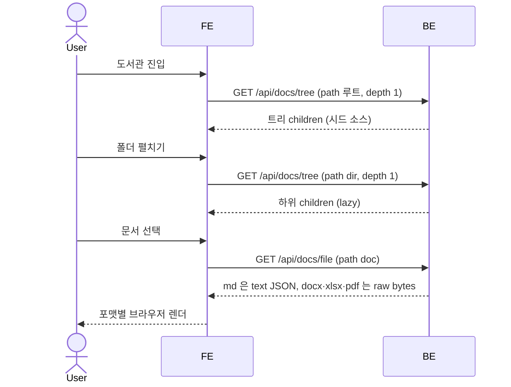

# SC-SPEC-01 도서관

시드로 사전탑재된 docx / xlsx / pdf / md 문서를 폴더 트리로 탐색하고 브라우저에서 렌더링해 읽는 공간을 보장한다.

> 기능/정책 묶음 단위의 **외부 계약**. client / QA / 외부 통합이 이 문서만 읽고 쓸 수 있어야 합니다.
> table schema 전문, ORM field, repository/service 구조는 본문에 두지 않습니다. 구현 중 DDD/schema 초안은 관련 WP, 실제 schema 는 코드/migration 이 SoT 입니다.

---

## 1. 개요 (Why)

### 메타

- Domain note: 외부에 드러나는 resource = 문서 트리(폴더/파일), 문서 콘텐츠/메타. 상태 enum 없음(읽기 전용 시드). 관련 WP 미정.
- Open Questions: 없음 (전부 해소) — ~~SC-OPEN-01 (렌더링 방식)~~ → 해소(클라이언트 렌더) · ~~SC-OPEN-02 (디자인 전달)~~ → 해소 · ~~SC-OPEN-16 (검색)~~ → 해소(v1 Out of Scope) — §6 참조

### Business Requirement

- sc_demo 는 mediness 판매용 데모 앱이고, 첫 제품 스펙은 "도서관" 이다.
- 데모 방문자가 **별도 준비 없이** docx/xlsx/pdf/md 문서가 브라우저 안에서 실제로 렌더되어 보이는 경험을 확인할 수 있어야 한다 (시드 사전탑재 → 즉시 열람).
- mediness 도서관의 폴더 트리 + 뷰어 UX 를 레퍼런스로 차용하되, 데모 범위는 **읽기(열람)** 에 한정한다.

---

## 2. 사용자 경험 (What)

> **디자인 SoT**: `claude-design/onto/` — 화면 셸 `shell.jsx`, 도서관 화면 `library.jsx`, 시드 트리/포맷 `library-data.jsx`, 토큰 `styles/tokens.css`·`styles/onto.css`. 아래 Placement/Wireframe/UX Contract 는 이 디자인을 실측해 고정한 것이다(시각/UX/배치 한정).

### Placement

- 좌측 글로벌 사이드바(워크스페이스 네비게이션)의 **도서관** 탭. 사이드바 3탭 순서 = **도서관 / 개인스페이스 / 채팅** (도서관이 기본 진입 탭). 사이드바·로그인 셸은 feature 공통 토대로 SC-SPEC-05 cross-ref. (nav 라벨은 "도서관".)
- 도서관 화면은 **2-컬럼**:
  - **좌측 트리 패널** — 상단 검색 입력(`문서 · 폴더 검색`) + 폴더/파일 트리(스크롤) + 하단 푸터(`seed · read-only`).
  - **우측 뷰어 패널** — 파일 선택 시 상단에 path breadcrumb + 포맷 배지 + 메타(크기·수정일·`읽기 전용`) chrome, 그 아래 본문 렌더(또는 상태 화면).
- 트리 노드: 폴더는 caret(펼침/접힘) + 폴더 아이콘 + 이름 + 하위 항목 수, 파일은 이름 + 포맷 배지(`MD`/`DOCX`/`XLSX`/`PDF`/`FILE`). 선택 노드는 active 하이라이트.

#### Wireframe

```
┌─ 사이드바 ──┬─────────── 도서관 (2-컬럼) ───────────────────────┐
│ M mediness │  좌측 트리              │  우측 뷰어                │
│  workspace │ ┌────────────────────┐ │ ┌───────────────────────┐ │
│ ⌘K 검색    │ │ 🔍 문서·폴더 검색   │ │ │ 회사소개/…/소개.docx  │ │
│            │ ├────────────────────┤ │ │ DOCX  182KB · 05-28   │ │
│ 워크스페이스│ │ ▾ 📁 회사소개   2  │ │ │           읽기 전용   │ │
│ ▸ 도서관 ● │ │    소개.docx  DOCX │ │ ├───────────────────────┤ │
│ ▸ 개인스페 │ │    보안.pdf    PDF │ │ │                       │ │
│ ▸ 채팅     │ │ ▾ 📁 제품       3  │ │ │  (브라우저 렌더 본문) │ │
│            │ │   ▾ 📁 온톨로지 2  │ │ │                       │ │
│            │ │      개요.md   MD  │ │ │                       │ │
│            │ │    매핑.xlsx  XLSX │ │ │                       │ │
│            │ │ ▸ 📁 데이터     1  │ │ │                       │ │
│            │ │ ▸ 📁 부록       0  │ │ │                       │ │
│ 민 김민준  │ ├────────────────────┤ │ │                       │ │
│  임상개발  │ │ ⛁ seed · read-only │ │ │                       │ │
└────────────┴─┴────────────────────┴─┴─┴───────────────────────┴─┘
```

> 시드 트리 예시(library-data): `회사소개/`(소개.docx·보안.pdf) · `제품/`(`온톨로지/` 개요.md·시작하기.md, 진단코드 매핑.xlsx, 제품 백서.pdf) · `데이터/`(아키텍처.png = 미지원) · `부록/`(빈 폴더). 즉 디자인에 **미지원 포맷(.png)** 과 **빈 폴더** 케이스가 실제로 포함되어 있다.

### UX Contract

- **화면 상태**: 뷰어 영역이 선택 상태에 따라 전환된다 — (1) **미선택**: 안내 상태("문서를 선택하세요"), (2) **폴더 선택**: 항목 있으면 `{폴더명} · N개 항목` 안내, 비었으면 "빈 폴더", (3) **파일 정상**: 상단 chrome(path·포맷·크기·수정일·`읽기 전용`) + 본문 렌더, (4) **미지원 포맷**: warn 상태("지원하지 않는 포맷"), (5) **콘텐츠 없음**: warn 상태("문서를 찾을 수 없음"). 트리 노드는 펼침/접힘(caret) 및 선택 active 상태를 가진다.
- **문구**(디자인 실측):
  - 미선택: "문서를 선택하세요" / "좌측 트리에서 문서를 열면 이 영역에 브라우저 렌더 결과가 표시됩니다."
  - 빈 폴더: "빈 폴더" / "이 폴더에는 표시할 문서가 없습니다."
  - 폴더(항목 있음): 제목 = 폴더명 / "{N}개 항목 · 좌측 트리에서 문서를 선택하세요."
  - 미지원 포맷: "지원하지 않는 포맷" / "{파일명} — md · docx · xlsx · pdf 만 렌더할 수 있습니다."
  - 콘텐츠 없음: "문서를 찾을 수 없음" / "{파일명} 의 콘텐츠를 불러올 수 없습니다."
  - 뷰어 메타: `읽기 전용` 배지 / 트리 푸터 `seed · read-only` / 검색 placeholder `문서 · 폴더 검색`.
- **CTA**: 읽기 전용 공간이라 생성/편집/업로드 CTA 없음. 상호작용은 (a) 폴더 노드 클릭 → 펼침/접힘, (b) 파일 노드 클릭 → 우측 뷰어에 렌더. (검색 입력란은 표시되더라도 v1 비활성 — §6 SC-OPEN-16, v1 Out of Scope.)
- **UX 기대 결과**: 트리에서 문서를 고르면 즉시 우측에 해당 포맷이 브라우저 렌더로 보이고(별도 다운로드 없이), 폴더 펼침/선택·미지원·빈 폴더 등 모든 분기가 뷰어 영역의 상태 화면으로 일관되게 표현된다.

> 기능 케이스(어떤 동작이 어떤 결과를 내야 하는가)는 아래 User Scenario 가 SoT. 본 UX Contract 는 디자인에서 관찰된 시각/문구/배치를 고정한다.

### User Scenario

케이스별 시나리오. 각 줄 `{조건/동작} → {결과}`. 기능 계약이며 시각 표현은 §2 UX Contract 로 분리.

- (정상·md) md 문서 선택 → 본문 영역에 마크다운이 렌더되어 표시
- (정상·docx) docx 문서 선택 → 본문 영역에 문서 내용이 브라우저에서 렌더되어 표시
- (정상·xlsx) xlsx 문서 선택 → 본문 영역에 표(시트) 내용이 브라우저에서 렌더되어 표시
- (정상·pdf) pdf 문서 선택 → 본문 영역에 PDF 가 브라우저에서 렌더되어 표시
- (정상·탐색) 폴더 노드 클릭 → 해당 폴더의 하위 폴더/문서 목록이 펼쳐짐 (lazy 로드)
- (경계·빈 폴더) 하위 항목이 없는 폴더 선택 → 빈 폴더로 표시 (오류 아님)
- (비정상·문서 없음) 존재하지 않는 문서 경로 진입 → "문서를 찾을 수 없음" 표시 (case matrix `DOC_NOT_FOUND`)
- (비정상·미지원 포맷) docx/xlsx/pdf/md 외 포맷 문서 진입 → "지원하지 않는 포맷" 표시, 렌더 시도 안 함 (case matrix `UNSUPPORTED_FORMAT`)
- (비정상·잘못된 경로) 트리 루트 밖/허용되지 않은 area 경로 진입 → "찾을 수 없음" 표시 (case matrix `INVALID_PATH`)

> 전체 end-to-end 흐름은 §3 Flow 의 sequence diagram 으로 (여기선 케이스 나열에 집중).

---

## 3. 계약 (How — 인터페이스)

> 아래 Method/Path/쿼리 형태는 mediness 도서관 docs API 의 관찰된 contract 를 모델로 한다. 구현 파일 경로/내부 핸들러명은 spec 범위 밖(WP/코드 SoT).

### API 계약

| Method | Path | 요약 | 권한 |
|---|---|---|---|
| GET | `/api/docs/tree?path={path}&depth={n}` | 문서 트리 조회 (path 빈값 = 루트, depth 단위 lazy 로드) | admin (데모 전제: 전부 노출) |
| GET | `/api/docs/file?path={path}` | 문서 콘텐츠 + 메타 조회 (시드 소스) | admin (데모 전제: 전부 노출) |

#### Request / Response 상세

**GET `/api/docs/tree`** — 정상(200):

```json
{
  "data": {
    "children": [
      { "type": "dir", "name": "<폴더명>", "path": "<상대경로>", "count": 3 },
      { "type": "file", "name": "<파일명>", "path": "<상대경로>", "size": 12345, "updated_at": "<ISO8601>" }
    ]
  }
}
```

- `type`: `"dir"` | `"file"`
- `path`: 트리 루트 기준 상대 경로 (예: `products/sample/intro.md`)
- `count`(dir, 선택) 하위 항목 수 / `size`·`updated_at`(file, 선택) 메타
- `depth` 단위로 해당 레벨 children 만 반환 (하위는 후속 요청으로 lazy 로드)

**GET `/api/docs/file`** — 정상(200), **md/텍스트 포맷**:

```json
{
  "data": {
    "path": "<상대경로>",
    "content": "<문서 텍스트 본문>",
    "meta": {
      "size": 12345,
      "updated_at": "<ISO8601>",
      "frontmatter": { "...": "..." },
      "author": "<작성자 또는 null>"
    }
  }
}
```

- **docx / xlsx / pdf (바이너리 포맷)**: SC-OPEN-01 해소에 따라 **원본 raw bytes 를 그대로 서빙**한다 (서버사이드 변환 없음). `GET /api/docs/file` 는 바이너리 포맷에 대해 위 JSON 대신 **파일 원본 바이트**(적절한 `Content-Type`)를 응답하며, 클라이언트가 포맷별 라이브러리(docx-preview / SheetJS / react-pdf)로 렌더한다. (메타가 별도로 필요하면 `/api/docs/tree` 의 file 항목 메타(size·updated_at)를 사용 — 별도 메타 동봉 여부는 코드/WP altitude.)

### Validation

> 읽기 전용 시드 열람이라 사용자 입력 기반 생성/수정 없음. 입력 검증 대상 필드 없음 → 해당 없음. (경로 유효성·포맷 지원 여부는 아래 케이스 매트릭스에서 SoT.)

| 필드 | 규칙 |
|---|---|
| (해당 없음) | — |

### 케이스 매트릭스

> **모든 에러/경계 케이스의 단일 SoT**. API 상세는 정상 응답만, 에러는 전부 여기. (백엔드/프론트 출력 문구는 디자인 전달 후 확정 — 현재 동작 의미만 명세)

| 에러 코드 | 백엔드 출력 | 프론트 출력 | 표시 위치 |
|---|---|---|---|
| `DOC_NOT_FOUND` | 404 | "문서를 찾을 수 없음" — "{파일명} 의 콘텐츠를 불러올 수 없습니다." | 본문 영역(warn 상태 화면) |
| `UNSUPPORTED_FORMAT` | 415 (raw 요청 시) — 단 1차 가드는 FE: 트리가 확장자로 포맷을 판별, 4포맷 외는 렌더 요청 자체를 안 함 | "지원하지 않는 포맷" — "{파일명} — md · docx · xlsx · pdf 만 렌더할 수 있습니다.", 렌더 시도 안 함 | 본문 영역(warn 상태 화면) |
| `INVALID_PATH` | 404 | "문서를 찾을 수 없음" (디자인은 DOC_NOT_FOUND 와 동일 상태로 수렴 표시) | 본문 영역(warn 상태 화면) |
| (빈 폴더) | 200 (빈 children) | "빈 폴더" — "이 폴더에는 표시할 문서가 없습니다." (오류 아님) | 본문 영역(상태 화면) |

### Flow

end-to-end 흐름 (sequence diagram).



### 상태 / Lifecycle

해당 없음 — 읽기 전용 시드 문서로 외부 노출 상태(enum)/transition 없음.

---

## 4. 구현 규칙 (How — 내부)

### Frontend Implementation

> 리액트 구현 시작점. 구조 레퍼런스는 mediness 도서관(2-컬럼 트리/뷰어). 구체 라우트·컴포넌트 파일·렌더러 선택은 WP/코드 SoT — spec 에서 발명하지 않음.

- **라우트**: 코드/WP SoT. 디자인은 SPA 탭 전환(사이드바 `active` 상태)으로 URL 라우트를 쓰지 않는다 — 실제 라우트 채택 여부/경로는 구현 결정.
- **페이지 / 레이아웃**: 좌측 트리(검색란 v1 비활성) / 우측 뷰어 2-컬럼. 시각 세부는 §2 UX Contract.
- **컴포넌트**:
  - 재사용 패턴: 트리 노드(폴더/파일, lazy 펼침), md 렌더 뷰 (`react-markdown` + `remark-gfm`)
  - 신규(greenfield): docx / xlsx / pdf 의 in-browser 렌더 — mediness 에 없는 신규 역량. **SC-OPEN-01 해소**: docx = `docx-preview`, xlsx = `SheetJS`(sheet_to_html), pdf = `react-pdf`(pdf.js). 모두 클라이언트에서 raw bytes 를 받아 렌더(서버 변환 없음). 구체 버전 핀/뷰어 컨트롤은 코드/WP SoT.
- **상태 (state)**: 선택된 경로(트리/본문 동기화), 펼친 폴더의 children, 로드된 문서 콘텐츠 (서버 상태)
- **데이터 연동**: §3 API 계약 — 트리=`/api/docs/tree`, 콘텐츠=`/api/docs/file`

### Functional Rule

- 트리는 depth 단위 lazy 로드 (한 번에 전체 트리를 끌어오지 않음).
- 지원 포맷은 docx / xlsx / pdf / md 4종. 그 외 포맷은 렌더 시도 없이 `UNSUPPORTED_FORMAT` 처리.
- 시드 소스는 읽기 전용 — 업로드/수정/삭제/댓글/공유/버전 동작 없음 (v1 Out Of Scope).
- 권한 분기 없음 — 데모는 어드민 전제로 모든 문서를 노출.

### DB

**DB 테이블 없음** — 도서관은 읽기 전용 시드라 DB 에 행을 만들지 않는다. (유저=`users`/SPEC-03, 개인스페이스=`personal_docs`/SPEC-02, 채팅=`chat_*`/SPEC-04 가 DB 테이블을 소유.)

- 시드 소스 = **읽기 전용 파일시스템** (DB 테이블 아님). 백엔드는 마운트된 docs 루트 경로를 읽어 `/api/docs/tree` · `/api/docs/file` 로 서빙한다.
- **docs 루트 = 레포 안 `medi-doc/`** 디렉토리. dev/deploy 모두 이 디렉토리를 `backend` 컨테이너에 읽기 전용(`:ro`) bind-mount 한다 — 구체 host 경로(로컬/서버)와 마운트 설정은 SC-SPEC-05 §3 볼륨/마운트 SoT.
- 트리/파일 path 는 **마운트된 docs 루트(`medi-doc/`) 기준 상대경로**. 쓰기(업로드/수정/삭제) 없음 — 읽기 전용.
- docker-compose bind-mount 구체 설정·컨테이너 내부 마운트 지점은 SC-SPEC-05 + 후속 `work-01-library` WP/코드 SoT.
- md 외 바이너리(docx/xlsx/pdf)는 **원본 raw bytes 를 그대로 서빙**한다 (SC-OPEN-01 해소 — 서버사이드 변환 없음). 백엔드는 마운트된 docs 루트의 파일을 읽어 바이트를 내리고, 렌더는 전적으로 클라이언트 라이브러리가 담당.

---

## 5. 검증 (Verify)

### Acceptance Criteria

- [ ] 시드 docx / xlsx / pdf / md 문서가 각각 브라우저에서 렌더되어 보인다.
- [ ] 도서관 진입 시 폴더/문서 트리가 표시되고, 폴더를 펼치면 하위 항목이 lazy 로드된다.
- [ ] 트리에서 문서를 선택하면 우측 본문 영역에 해당 문서가 렌더된다.
- [ ] 존재하지 않는 문서 경로 진입 시 "찾을 수 없음" 이 표시된다 (`DOC_NOT_FOUND`).
- [ ] 지원하지 않는 포맷은 렌더를 시도하지 않고 미지원 안내가 표시된다 (`UNSUPPORTED_FORMAT`).
- [ ] 빈 폴더는 오류 없이 빈 상태로 표시된다.
- [x] §2 Placement / Wireframe / UX Contract(화면 상태·문구·CTA·UX 기대 결과)가 디자인(claude-design/onto) 기준으로 반영되었다 — 화면이 이를 따른다.

---

## 6. Open Questions

- **SC-OPEN-01 (렌더링 방식) — 해소(resolved)**: **선택지 A(클라이언트 렌더)** 로 확정 (조사·PO 결정 2026-06-07). 백엔드는 읽기 전용 파일시스템의 **원본 raw bytes 를 서빙**하고, 브라우저가 포맷별 클라이언트 라이브러리로 렌더한다(서버사이드 변환 없음). 포맷별 라이브러리:
  - **md** → `react-markdown` + `remark-gfm` (mediness 도서관 패턴 재사용)
  - **docx** → `docx-preview` (원본 서식 충실 렌더, 클라이언트)
  - **xlsx** → `SheetJS` (공식 CDN/레지스트리 배포 — npm `xlsx` 패키지 보안 이슈 회피, `sheet_to_html` 로 표 렌더)
  - **pdf** → `react-pdf` (pdf.js 래퍼; 생성용 `@react-pdf/renderer` 와 혼동 주의)
  - 결과: §3 바이너리 응답 = raw bytes, §4 Frontend Implementation/DB(raw 서빙), 케이스 매트릭스 `UNSUPPORTED_FORMAT` 가 본 결정에 맞춰 확정됨.
  - 전제: 소스가 읽기 전용 파일시스템이라 디스크에 원본 raw 파일이 존재 → raw 서빙이 가능하다. 라이브러리 **메이저 선택**은 본 spec 에 고정하되, 구체 버전 핀/패키지 설치 경로(SheetJS CDN URL 등)·뷰어 컨트롤 구현은 코드/WP SoT(SC-SPEC-05 SC-OPEN-15 버전 핀과 동일 altitude).
- **SC-OPEN-02 (디자인 전달) — 해소(resolved)**: 디자인(claude-design/onto: `shell.jsx`·`library.jsx`·`library-data.jsx`) 전달 완료. §2 Placement / Wireframe / UX Contract(화면 상태·문구·CTA·UX 기대 결과)에 반영됨. 단 디자인은 throwaway 프로토타입이므로 **시각/UX/배치만** 차용했고, 렌더 구현은 디자인 stub 이 아니라 별도 조사로 SC-OPEN-01 에서 확정했다(클라이언트 라이브러리).
- **SC-OPEN-16 (트리/문서 검색) — 해소(resolved)**: **v1 Out of Scope** (PO 결정 2026-06-07). 디자인의 트리 검색(`문서 · 폴더 검색`)·사이드바 `⌘K` 입력은 프로토타입 chrome 으로, v1 은 **트리 탐색만으로 충분**하다. 검색 입력란은 표시되더라도 동작하지 않으며(비활성/표시 전용), 트리 필터·전체 검색은 후속 WP 로 보류. 본문 §2 CTA 에 반영됨.
