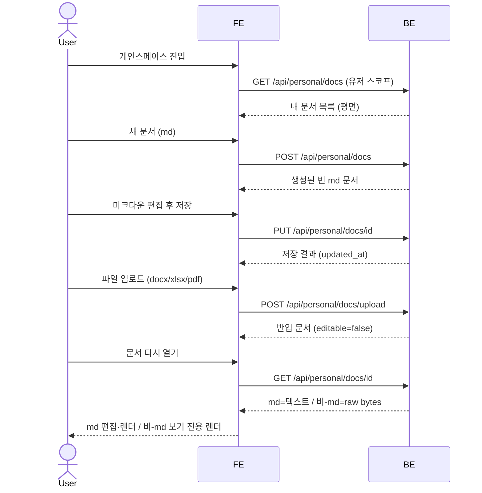

# SC-SPEC-02 개인스페이스

유저가 자기 문서만 보고 다루는 사적 read-write 작업실로, 브라우저 안에서 **md 문서를 직접 생성·편집·저장**하고, **md/docx/xlsx/pdf 파일을 업로드 반입**해 다시 열어 렌더해 볼 수 있도록 보장한다.

> 기능/정책 묶음 단위의 **외부 계약**. client / QA / 외부 통합이 이 문서만 읽고 쓸 수 있어야 합니다.
> table schema 전문, ORM field, repository/service 구조는 본문에 두지 않습니다. 구현 중 DDD/schema 초안은 관련 WP, 실제 schema 는 코드/migration 이 SoT 입니다.

> ★ **v1 범위 — 인앱 저작/편집은 md 전용** (PO 결정 2026-06-07): 새 문서 생성·인앱 편집은 **md 한 포맷**만(docx/xlsx 인앱 에디터는 v1 미포함). 단 **업로드 반입은 4포맷(md/docx/xlsx/pdf) 유지**하며, 업로드된 비-md(docx/xlsx/pdf)는 **보기 전용 렌더**(SC-SPEC-01 렌더 라이브러리 재사용)로 열람한다. 즉 v1 에서 docx/xlsx 는 "인앱 편집"에서 "업로드+보기 전용"으로 내려간다(pdf 와 동일 취급).

---

## 1. 개요 (Why)

### 메타

- Domain note: 외부에 드러나는 resource = 유저 스코프의 문서(메타 + 콘텐츠). 문서 메타는 DB 에 저장, 파일은 서버에 저장. 외부 노출 상태 enum 없음(생성/저장만, lifecycle 미정). 관련 WP = `work-02-personal-space`(미착수).
- Open Questions: ~~SC-OPEN-03 (pdf 진입)~~ → 업로드(보기 전용) · ~~SC-OPEN-04 (유저 식별)~~ → SC-SPEC-03 세션 · ~~SC-OPEN-05 (보기 렌더)~~ → SC-SPEC-01 라이브러리 재사용 · ~~SC-OPEN-06 (에디터)~~ → md 전용(소스+프리뷰), docx/xlsx 보기전용 · ~~SC-OPEN-09 (docx/xlsx 업로드)~~ → 업로드 4포맷 허용 · 문서 삭제 → v1 Out of Scope — §6 참조

### Business Requirement

- sc_demo 는 mediness 판매용 데모 앱이고, 도서관(SC-SPEC-01)이 공용·읽기전용 열람 공간이라면 개인스페이스은 **유저별 read-write 작업실** 이다.
- 데모 방문자가 자기 공간에서 **새 md 문서를 인앱으로 직접 만들고**, 마크다운을 편집해 **서버에 저장**하고, 다시 열어 렌더된 결과를 보는 경험을 확인할 수 있어야 한다.
- 도서관의 4포맷 렌더(보기) 경험을 재사용하되, 개인스페이스은 **쓰기(md 저작·편집·저장)** 와 **유저 격리(자기 문서만)** 를 추가로 보장한다.
- **업로드(4포맷 반입)**: 개인스페이스 반입 업로드는 **md/docx/xlsx/pdf 4포맷** 가능하다. 4포맷 외 형식은 거부(`UNSUPPORTED_UPLOAD_TYPE`). 업로드된 **md 는 인앱 편집 가능**, 업로드된 **docx/xlsx/pdf 는 보기 전용**(인앱 편집 없음).
- **v1 인앱 저작 경계**: 인앱 *생성/편집* 은 **md 1종**. docx/xlsx 인앱 에디터는 v1 미포함(후속 WP). 이 저작 경계는 SC-SPEC-04 채팅 도크의 "작성 어시스턴스 = md 한정" 쓰기 경계와 정확히 일치한다.
- **md 보기/편집 모드**: md 문서는 런타임 UI 상태로 **보기 모드 ↔ 편집 모드**를 가진다(같은 editable=true 문서 내에서 토글). 편집 모드에서만 본문이 dirty(`수정됨`)가 되고 `저장`이 활성화된다. 이 모드 구분은 SC-SPEC-04 도크 AI 의 in-place 반영 게이팅 근거다 — 도크 AI 는 **편집 모드일 때만** 에디터 내용에 직접 반영하고, 영속은 기존 `저장` 경로(`PUT /api/personal/docs/{id}`)를 재사용한다(새 write 경로 없음). 보기/편집은 런타임 상태이며 `personal_docs` 에 새 컬럼을 요구하지 않는다(아래 §4 DB 판단).

---

## 2. 사용자 경험 (What)

> **디자인 SoT**: `claude-design/onto/` — 화면 셸 `shell.jsx`, 개인스페이스 화면 `myspace.jsx`, 도크 AI `chat.jsx`(DockChat), 토큰 `styles/tokens.css`·`styles/onto.css`. 아래는 이 디자인을 실측해 **v1 경계(인앱 저작 md 전용 / 업로드·보기 4포맷)** 로 고정한 것이다.

### Placement

- 좌측 글로벌 사이드바의 **개인스페이스** 탭 (사이드바 3탭 = 도서관 / 개인스페이스 / 채팅; nav 라벨 = "개인스페이스", SC-SPEC-05 cross-ref). ※ spec 제목 "개인스페이스" ↔ 디자인 nav 라벨 "개인스페이스" — 용어 통일은 후속 flag.
- 개인스페이스 화면은 **좌·중·(우) 3-영역**:
  - **좌측 목록 패널** — 상단 `내 문서`(+개수) / `새 문서`(md) 버튼 + `업로드` 버튼, 그 아래 내 문서 평면 목록(각 항목: 포맷 배지 + 제목 + 수정시각, 보기 전용은 `· 보기 전용`).
  - **중앙 에디터/뷰 패널** — 상단 chrome(제목 + 포맷 배지 + 저장 상태(`수정됨`/`저장됨`)·`저장`(md) 또는 `보기 전용` 표시 + `AI` 토글), 그 아래 md 편집 또는 비-md 보기 렌더.
  - **우측 AI 도크(선택)** — `AI 어시스턴트` 도크 채팅(surface=personal). **SC-SPEC-04 채팅의 도크 배치**로, 본 spec 은 배치 사실만 노트하고 채팅 계약은 SC-SPEC-04 가 SoT. 도크 AI 는 현재 열린 문서를 컨텍스트로 받으며, **편집 모드 + md 문서**일 때만 현재 에디터 내용에 in-place 반영하고 저장은 본 spec 의 기존 `저장` 경로를 재사용한다.
- `새 문서` 버튼은 v1 에서 **md 단일**(디자인의 md/docx/xlsx 메뉴 중 md 만). `업로드` 버튼은 4포맷(md/docx/xlsx/pdf).

#### Wireframe

```
┌─ 사이드 ─┬──── 내 문서 목록 ────┬──── md 편집 / 비-md 보기 ──┬─ AI 도크 ─┐
│ 도서관   │ 내 문서          4   │ [주간 업무 메모  ]  MD       │ ✦ AI 어시 │
│ 개인스페●│ [+ 새 문서] [⤒업로드]│  수정됨    [✓ 저장]      AI  │ 근거:주간…│
│ 채팅     │ ┌──────────────────┐ │ ┌─────────────────────────┐ │ ┌───────┐ │
│          │ │ MD 주간 업무 메모│ │ │ # 주간 업무 메모          │ │ │md 초안│ │
│          │ │ DOCX 분기 보고서 │ │ │ 이번 주 …                │ │ │[저장] │ │
│          │ │   · 보기 전용    │ │ │ ## 완료                  │ │ └───────┘ │
│          │ │ XLSX 실험 데이터 │ │ │ - KCD 매핑 검수          │ │ 현재 문서 │
│          │ │   · 보기 전용    │ │ │   (md 소스 ↔ 렌더)       │ │ 근거로…   │
│ 민 김민준│ │ PDF 참고 백서    │ │ └─────────────────────────┘ │ [전송]    │
└──────────┴─└──────────────────┘─┴─────────────────────────────┴───────────┘
   비-md(docx/xlsx/pdf) 선택 시 → 중앙은 "보기 전용" 렌더 (저장 버튼 대신 보기 전용 표시)
```

> v1 미반영(디자인엔 있으나 Out of Scope): `새 문서` 메뉴의 docx/xlsx, **docx 리치 에디터·xlsx 편집 그리드**(→ v1 은 보기 전용).

### UX Contract

- **화면 상태**: (1) **빈 공간**(0개): "아직 문서가 없습니다" 빈 상태, (2) **미선택**: "문서를 선택하세요", (3) **md 보기 모드**: 마크다운 렌더 표시(편집 동작 전), (4) **md 편집 모드**: 마크다운 본문 편집 + 저장 상태 `수정됨`/`저장됨`, `저장` 은 dirty 일 때만 활성, (5) **저장 직후**: "저장되었습니다" 토스트, (6) **비-md 보기**: 렌더 + `보기 전용` 표시(저장/편집 없음), (7) **업로드 결과**: 성공 토스트(`{파일명} 업로드됨`, pdf 는 `· 보기 전용`) / 미지원 형식 토스트, (8) **문서 없음/접근 불가**: 케이스 매트릭스. 목록 항목 선택 active 하이라이트. ※ md 의 보기↔편집은 **런타임 UI 상태**(같은 editable=true 문서 내 토글) — DB 컬럼 아님.
- **문구**(디자인 실측):
  - 빈 공간: "아직 문서가 없습니다" / "새 문서를 만들어 시작하세요"
  - 미선택: "문서를 선택하세요" / "좌측에서 문서를 열거나 새 문서를 만들어 작성을 시작하세요."
  - 저장 상태: `수정됨` ↔ `저장됨`, 저장 토스트 "저장되었습니다"
  - 보기 전용: `보기 전용`
  - 업로드: "{파일명} 업로드됨"(pdf 는 "· 보기 전용") / "업로드할 수 없는 형식입니다 (.{ext}) — md · docx · xlsx · pdf 만 가능"
  - 버튼/라벨: `새 문서`, `업로드`, `저장`, `AI`, 목록 헤더 `내 문서`
- **CTA**: (a) `새 문서`(md) → 빈 md 생성·열림, (b) `업로드`(md/docx/xlsx/pdf) → 반입, (c) 문서 클릭 → md 편집 / 비-md 보기 렌더, (d) md 본문 편집 → `수정됨`, (e) `저장` → PUT(md) + 토스트, (f) `AI` 토글 → 도크 채팅(SC-SPEC-04).
- **UX 기대 결과**: 유저는 자기 문서만 평면 목록에서 보고, md 는 새로 만들어 쓰고 저장하면 즉시 반영, docx/xlsx/pdf 는 업로드해 보기 전용으로 렌더해 본다. 모든 분기가 화면에 일관 표현된다.

> 기능 케이스(어떤 동작이 어떤 결과를 내야 하는가)는 아래 User Scenario 가 SoT. 본 UX Contract 는 디자인 실측 시각/문구/배치를 v1 경계로 고정한다.

### User Scenario

케이스별 시나리오. 각 줄 `{조건/동작} → {결과}`. 기능 계약이며 시각 표현은 §2 UX Contract 로 분리.

- (정상·생성) `새 문서`(md) → 빈 md 문서가 생성되어 편집 가능한 상태로 열림
- (정상·보기·md) 내 md 문서 선택 → 마크다운이 렌더되어 표시 (보기 모드, 도서관 md 패턴 재사용)
- (정상·편집·md) md 문서를 편집 모드로 전환해 마크다운 본문을 직접 작성/수정 → 상태 `수정됨` (보기 ↔ 편집은 같은 editable=true 문서 내 런타임 UI 상태)
- (정상·저장) 편집 중 `저장` → md 파일이 서버에 저장되고 메타(수정 시각)가 갱신, 상태 `저장됨` + 토스트
- (정상·도크 AI in-place·편집) **편집 모드 + md 문서**에서 SC-SPEC-04 도크 AI 가 작성 요청을 받으면 → 현재 에디터 내용에 직접 반영, 상태 `수정됨`; 유저가 기존 `저장`(`PUT /api/personal/docs/{id}`)으로 확정 (AI 자동 저장 없음, 새 write 경로 없음)
- (제약·도크 AI 답변만·보기/비-md) **보기 모드** 또는 **비-md 문서**에서 도크 AI 요청 → AI 는 의견/답변만, 현재 문서에 쓰지 않음
- (정상·목록) 개인스페이스 진입 → 내가 만든/올린 문서만 목록(평면)으로 표시
- (정상·업로드) md/docx/xlsx/pdf 업로드 → 내 문서로 반입되어 목록에 표시
- (정상·보기·비-md) 업로드된 docx/xlsx/pdf 선택 → 본문 영역에 보기 전용으로 렌더 (SC-SPEC-01 렌더 라이브러리 재사용)
- (제약·비-md 편집 불가) docx/xlsx/pdf 편집 시도 → 보기 전용으로 편집 동작 없음
- (경계·빈 공간) 만든 문서가 하나도 없음 → 빈 상태로 표시 (오류 아님)
- (비정상·문서 없음) 존재하지 않는 문서 접근 → "문서를 찾을 수 없음" (case matrix `DOC_NOT_FOUND`)
- (권한·타 유저 문서) 다른 유저의 문서 접근 시도 → 접근 차단 (case matrix `FORBIDDEN`. 유저 식별 = SC-SPEC-03 로그인 세션)
- (비정상·비-md 생성) md 외 *생성* 요청(BE 직접 호출 등) → 처리 안 함 (case matrix `UNSUPPORTED_FORMAT`. UI 의 `새 문서` 는 md 만 제공)
- (비정상·잘못된 업로드) 4포맷 외 파일 업로드 → "업로드할 수 없는 형식" (case matrix `UNSUPPORTED_UPLOAD_TYPE`)

> 전체 end-to-end 흐름은 §3 Flow 의 sequence diagram 으로 (여기선 케이스 나열에 집중).

---

## 3. 계약 (How — 인터페이스)

> 아래 Method/Path 는 유저 스코프 문서(생성=md / 업로드=4포맷 / 보기·저장)의 계약 모델이다. 구현 파일 경로/내부 핸들러명은 spec 범위 밖(WP/코드 SoT).
> 유저 식별(유저 스코프 결정 방식)은 **SC-SPEC-03 로그인 세션 기반 유저 식별** — 권한·요청 표기의 유저 식별은 SC-SPEC-03 인증 세션의 유저를 근거로 한다. (인증 자격의 구체 메커니즘은 SC-SPEC-03 SC-OPEN-07.)

### API 계약

| Method | Path | 요약 | 권한 |
|---|---|---|---|
| GET | `/api/personal/docs` | 내 문서 목록(평면) 조회 — 유저 스코프 | 유저 본인 (식별 = SC-SPEC-03 로그인 세션) |
| POST | `/api/personal/docs` | 새 **md** 문서 생성 (빈 문서) — 유저 스코프 | 유저 본인 (식별 = SC-SPEC-03 로그인 세션) |
| GET | `/api/personal/docs/{id}` | 내 문서 단건 조회 (md=텍스트 / 비-md=raw bytes + 메타) | 유저 본인 (식별 = SC-SPEC-03 로그인 세션) |
| PUT | `/api/personal/docs/{id}` | 내 **md** 문서 수정(저장) | 유저 본인 (식별 = SC-SPEC-03 로그인 세션) |
| POST | `/api/personal/docs/upload` | 파일 업로드 반입(multipart, **4포맷 md/docx/xlsx/pdf**) — 유저 스코프 | 유저 본인 (식별 = SC-SPEC-03 로그인 세션) |

#### Request / Response 상세

**GET `/api/personal/docs`** — 정상(200), 목록(평면):

```json
{
  "data": {
    "items": [
      {
        "id": "<문서 식별자>",
        "title": "<문서 제목>",
        "format": "md | docx | xlsx | pdf",
        "editable": true,
        "updated_at": "<ISO8601>",
        "created_at": "<ISO8601>"
      }
    ]
  }
}
```

- 목록은 평면(flat) — 폴더/트리 구조 없음 (v1 Out Of Scope).
- `editable`: md = `true`(인앱 편집), docx/xlsx/pdf = `false`(보기 전용).
- 유저 스코프: 호출 유저 본인의 문서만 반환 (유저 식별 = SC-SPEC-03 로그인 세션).

**POST `/api/personal/docs`** — 정상(201), 생성(md 전용):

```json
{
  "data": {
    "id": "<문서 식별자>",
    "title": "<문서 제목>",
    "format": "md",
    "created_at": "<ISO8601>"
  }
}
```

- 요청 body: `title` 수준. 생성 직후 문서는 빈 마크다운 콘텐츠. v1 은 **md 만 생성** — md 외 지정은 `UNSUPPORTED_FORMAT`(BE 방어, UI 는 md 만 제공).

**GET `/api/personal/docs/{id}`** — 정상(200), 단건:

```json
{
  "data": {
    "id": "<문서 식별자>",
    "title": "<문서 제목>",
    "format": "md | docx | xlsx | pdf",
    "editable": true,
    "content": "<md 일 때 마크다운 텍스트>",
    "meta": { "updated_at": "<ISO8601>", "created_at": "<ISO8601>" }
  }
}
```

- **md**: `content` = 마크다운 텍스트(편집 가능). 렌더 = `react-markdown`+`remark-gfm`.
- **docx / xlsx / pdf**: SC-SPEC-01 과 동일하게 **원본 raw bytes 를 서빙**(JSON content 대신 파일 바이트)하고, 클라이언트가 보기 전용 라이브러리(docx-preview / SheetJS / react-pdf)로 렌더. `editable=false`.

**PUT `/api/personal/docs/{id}`** — 정상(200), 저장(md 전용):

```json
{
  "data": { "id": "<문서 식별자>", "updated_at": "<ISO8601>" }
}
```

- 요청 body: 마크다운 `content` 및 필요 시 `title`. **md 문서에만 적용** — docx/xlsx/pdf(`editable=false`)는 저장 대상 아님(보기 전용).

**POST `/api/personal/docs/upload`** — 정상(201), 업로드 반입(4포맷):

```json
{
  "data": {
    "id": "<문서 식별자>",
    "title": "<문서 제목>",
    "format": "md | docx | xlsx | pdf",
    "editable": true,
    "created_at": "<ISO8601>"
  }
}
```

- 요청: multipart 파일 업로드. **허용 = 4포맷(md/docx/xlsx/pdf)** — 4포맷 외면 `UNSUPPORTED_UPLOAD_TYPE`.
- 업로드된 **md** = `editable=true`(인앱 편집 가능), **docx/xlsx/pdf** = `editable=false`(보기 전용).
- 파일은 서버에 저장, 메타(제목/포맷/타임스탬프 + 파일 경로)는 DB 에 기록.

### Validation

> 입력 검증 규칙 — **어떤 입력이 valid 한가** 만. FE(즉시 피드백·UX) / BE(최종 신뢰 경계·보안) 가 같은 규칙을 각자 구현.
> 위반 시 에러코드·표시·위치는 케이스 매트릭스의 해당 행.

| 필드 | 규칙 |
|---|---|
| `format` (생성) | v1 은 `md` 고정. 그 외 → `UNSUPPORTED_FORMAT` (BE 방어) |
| `title` | 문서 제목. 구체 길이/문자 제약은 코드 SoT (본문 미확정) |
| `content` (저장) | 마크다운 텍스트(md 문서만). 구체 길이 제한은 코드 SoT (본문 미확정) |
| 업로드 파일 (업로드) | 4포맷(md/docx/xlsx/pdf) 한정. 외 형식 → `UNSUPPORTED_UPLOAD_TYPE`. 크기 제한/검증 방식은 코드 SoT (본문 미확정) |

### 케이스 매트릭스

> **모든 에러/경계 케이스의 단일 SoT**. API 상세는 정상 응답만, 에러는 전부 여기.

| 에러 코드 | 백엔드 출력 | 프론트 출력 | 표시 위치 |
|---|---|---|---|
| `DOC_NOT_FOUND` | 404 | "문서를 찾을 수 없음" | 에디터/본문 영역 |
| `UNSUPPORTED_FORMAT` | 400 | "지원하지 않는 포맷" (생성은 md 만, BE 방어 — 정상 경로 미발생) | 에디터/본문 영역 |
| `UNSUPPORTED_UPLOAD_TYPE` | 400 | "업로드할 수 없는 형식 (.{ext}) — md · docx · xlsx · pdf 만 가능", 처리 안 함 | 업로드(토스트) |
| `FORBIDDEN` | 403 | "접근할 수 없음" | 에디터/본문 영역 |
| (빈 공간) | 200 (빈 items) | "아직 문서가 없습니다" 빈 상태 (오류 아님) | 목록 영역 |

> 유저 식별 = **SC-SPEC-03 로그인 세션**. `FORBIDDEN` 은 로그인 세션 유저와 문서 소유 유저 불일치 시 차단. 미인증 호출 자체는 SC-SPEC-03 `UNAUTHENTICATED`.

### Flow

end-to-end 흐름 (sequence diagram).



### 상태 / Lifecycle

해당 없음 — v1 은 생성/저장/업로드만 다루며 외부 노출 상태(enum)/transition 을 두지 않는다. (문서 삭제는 v1 Out of Scope — §6.)

---

## 4. 구현 규칙 (How — 내부)

### Frontend Implementation

> 리액트 구현 시작점. 보기/렌더는 도서관 4포맷 렌더 라이브러리 재사용, md 편집만 신규(경량). 구체 라우트·컴포넌트 파일·버전 핀은 WP/코드 SoT.

- **라우트**: 코드/WP SoT. 디자인은 SPA 탭 전환(사이드바 `active` 상태)으로 URL 라우트를 쓰지 않는다.
- **페이지 / 레이아웃**: 좌(내 문서 목록 평면 + 새 문서·업로드) · 중(md 편집 / 비-md 보기) · 우(AI 도크, SC-SPEC-04). 시각 세부는 §2 UX Contract.
- **컴포넌트**:
  - 재사용 패턴: **4포맷 보기 렌더** — 도서관(SC-SPEC-01)의 라이브러리 재사용(md=`react-markdown`+`remark-gfm`, docx=`docx-preview`, xlsx=`SheetJS`, pdf=`react-pdf`).
  - 신규(경량): **md 편집** — SC-OPEN-06 해소: **마크다운 소스 textarea + react-markdown 라이브 프리뷰**(새 무거운 에디터 라이브러리 없음). docx/xlsx/pdf 는 v1 보기 전용이라 리치에디터/편집 그리드 불필요. (대안 `@uiw/react-md-editor` 는 업그레이드 옵션, 버전 핀은 본문 외.)
- **상태 (state)**: 내 문서 목록(서버 상태), 선택 문서(md=편집 중 dirty 로컬 + 저장 시 서버 동기화 / 비-md=보기), 저장 상태(`저장됨`/`수정됨`).
- **데이터 연동**: §3 API 계약 — 목록=`GET`, 생성=`POST`, 조회=`GET /{id}`, 저장=`PUT /{id}`, 업로드=`POST /upload`.

### Functional Rule

- 개인스페이스은 **read-write** — 유저는 자기 md 문서를 생성·편집·저장한다 (도서관과 달리 쓰기 허용).
- **md 보기/편집 모드(런타임)**: md 문서(editable=true)는 **보기 모드 ↔ 편집 모드**를 런타임 UI 상태로 가진다. 편집 모드에서만 본문이 dirty(`수정됨`)가 되고 `저장`이 활성화된다. 이 모드는 `personal_docs` 컬럼이 아니라 클라이언트 런타임 상태로 판단한다(아래 DB 판단 참조). 비-md(editable=false)는 항상 보기 전용.
- **v1 인앱 저작 = md 전용**: 인앱 *생성/편집* 은 마크다운 1종. docx/xlsx 인앱 에디터는 v1 미포함. UI `새 문서` 는 md 만 제공하며, BE 는 md 외 생성을 `UNSUPPORTED_FORMAT` 로 방어.
- **업로드 반입(4포맷)**: md/docx/xlsx/pdf 반입 가능. 4포맷 외는 `UNSUPPORTED_UPLOAD_TYPE`. 업로드된 **md = 편집 가능**, **docx/xlsx/pdf = 보기 전용**(`editable=false`).
- **보기 렌더 재사용**: 모든 포맷 보기는 도서관(SC-SPEC-01)의 클라이언트 렌더 라이브러리를 재사용한다. 비-md 는 raw bytes 를 받아 렌더(서버 변환 없음).
- **유저 격리**: 유저는 자기 문서만 목록/조회/수정 가능. 타 유저 문서 접근은 `FORBIDDEN`. 유저 식별 = **SC-SPEC-03 로그인 세션**. 미인증 호출은 SC-SPEC-03 `UNAUTHENTICATED`.
- **채팅 도크 in-place 연동**: SC-SPEC-04 채팅 도크(surface=personal)는 **편집 모드 + md 문서**일 때만 AI 가 현재 에디터 내용에 in-place 반영하고(상태 `수정됨`), 영속은 본 개인스페이스 **기존 저장 경로(`PUT /api/personal/docs/{id}`)를 재사용**한다 — 채팅 전용 별도 write 경로/새 문서 양산 없음, AI 자동 저장 없음. 보기 모드/비-md 는 AI 가 현재 문서에 쓰지 않는다. (게이팅·트리거 = SC-SPEC-04 SC-OPEN-11.)
- v1 미포함(Out of Scope): docx/xlsx **인앱 편집**, 폴더/트리, 공유·댓글·버전, 문서 삭제.

### DB

문서 **메타데이터는 DB 테이블 `personal_docs`** 에 저장하고, **콘텐츠(파일 본체)는 서버 파일시스템**에 저장한다 (md=마크다운 텍스트, docx/xlsx/pdf=원본 바이트). DB 메타가 그 파일의 경로를 가리킨다.

**테이블 `personal_docs`**

| 컬럼 | 타입(설계) | 키/제약 | 설명 |
|---|---|---|---|
| `id` | UUID 또는 serial | PK | 문서 식별자 |
| `user_id` | (users.id) | FK→users, NOT NULL | 소유 유저 (**유저 격리 근거**, SC-SPEC-03) |
| `title` | varchar | NOT NULL | 문서 제목 |
| `format` | varchar(enum) | NOT NULL | `md` / `docx` / `xlsx` / `pdf` |
| `editable` | boolean | NOT NULL | md=`true`(인앱 편집) / 비-md=`false`(보기 전용) |
| `file_path` | varchar | NOT NULL | 서버 FS 상 파일 경로 (콘텐츠 본체는 DB 아님) |
| `created_at` | timestamptz | NOT NULL, default now() | 생성 시각 |
| `updated_at` | timestamptz | NOT NULL | 수정 시각 |

- **인덱스**: `user_id` (유저별 평면 목록 조회).
- **보기/편집 모드 = DB 컬럼 아님(판단)**: md 의 보기↔편집 모드는 **런타임 UI 상태**일 뿐이라 `personal_docs` 에 새 컬럼을 추가하지 않는다. `editable` 컬럼은 **문서의 능력**(md=`true` 인앱 편집 가능 / 비-md=`false` 보기 전용)을 나타내고, 보기/편집 모드는 그 능력 안에서의 **런타임 토글**이다(editable=true 문서가 시점에 따라 보기/편집 — 같은 행, 컬럼 변화 없음). 둘은 의미가 분리되어 충돌하지 않으며, SC-SPEC-04 도크 AI 게이팅도 이 런타임 상태(메시지 `edit_mode`)로 판단하므로 DB 변경이 필요 없다.
- 인앱 생성(md)·업로드 반입(4포맷) 모두 같은 테이블에 행을 만들고, 콘텐츠는 `file_path` 가 가리키는 서버 파일에 저장한다. 비-md 보기는 raw bytes 를 그대로 서빙(SC-SPEC-01 동일 altitude) — 서버사이드 변환 없음.
- PK 타입·`format` enum vs varchar·저장 위치(로컬 FS vs object storage)·디렉토리 레이아웃·업로드 크기 제한·인덱스/migration 세부는 **코드/migration 최종 SoT** — 위 표는 설계(초안)이며 컬럼 의미를 고정한다.

---

## 5. 검증 (Verify)

### Acceptance Criteria

- [ ] 개인스페이스에서 새 md 문서를 인앱으로 생성할 수 있다 (`새 문서` → 빈 md 문서 생성·열림).
- [ ] 생성/업로드한 md 의 마크다운을 편집·저장하면 서버에 저장되고 메타가 갱신되며 상태가 `저장됨` 으로 전환된다.
- [ ] 개인스페이스 진입 시 내가 만든/올린 문서만 평면 목록으로 표시된다.
- [ ] md 문서를 선택하면 마크다운이 렌더되어 보인다 (보기 모드, 도서관 md 렌더 재사용); 편집 모드로 전환하면 본문을 편집할 수 있고 `수정됨` 으로 전환된다. 보기↔편집은 런타임 UI 상태이며 DB 컬럼이 아니다.
- [ ] SC-SPEC-04 도크 AI 의 in-place 반영은 **편집 모드 + md 문서**일 때만 현재 에디터 내용에 적용되고, 저장은 기존 `PUT /api/personal/docs/{id}` 를 재사용한다(새 write 경로/새 문서 없음, AI 자동 저장 없음). 보기 모드/비-md 는 적용되지 않는다.
- [ ] md/docx/xlsx/pdf 파일을 업로드하면 내 문서로 반입되어 목록에 표시된다.
- [ ] 업로드된 docx/xlsx/pdf 는 선택 시 보기 전용으로 렌더된다(편집 동작 없음).
- [ ] 다른 유저의 문서에는 접근할 수 없다 (`FORBIDDEN`).
- [ ] 존재하지 않는 문서 접근 시 "문서를 찾을 수 없음" 이 표시된다 (`DOC_NOT_FOUND`).
- [ ] 4포맷 외 파일 업로드는 처리하지 않고 미지원 안내가 표시된다 (`UNSUPPORTED_UPLOAD_TYPE`).
- [ ] md 외 *생성* 은 BE 가 `UNSUPPORTED_FORMAT` 로 방어한다 (UI `새 문서` 는 md 만 제공).
- [ ] 문서가 하나도 없을 때 오류 없이 "아직 문서가 없습니다" 빈 상태로 표시된다.
- [x] §2 Placement / Wireframe / UX Contract 가 디자인(claude-design/onto) 기준 v1 경계로 반영되었다.

---

## 6. Open Questions

v1 경계(인앱 저작 md 전용 / 업로드·보기 4포맷)로 OQ 가 모두 해소되거나 보류되었다.

- **SC-OPEN-03 (pdf 진입) — 해소(resolved)**: pdf 진입 = **업로드**(보기 전용, 인앱 편집 없음). 본문 §2/§3 업로드·§4 Functional Rule 반영.
- **SC-OPEN-04 (유저 식별) — 해소(resolved)**: 유저 식별 = **SC-SPEC-03 유저 로그인 세션** ([doc/spec/spec-03-user.md](spec-03-user.md)). 인증 자격 메커니즘(쿠키 세션 vs JWT)은 SC-SPEC-03 SC-OPEN-07.
- **SC-OPEN-05 (보기 렌더 방식) — 해소(resolved)**: 모든 포맷 보기 = **SC-SPEC-01 클라이언트 렌더 라이브러리 재사용**(md=react-markdown, docx=docx-preview, xlsx=SheetJS, pdf=react-pdf). 비-md 는 raw bytes 서빙.
- **SC-OPEN-06 (에디터 컴포넌트) — 해소(resolved)**: v1 인앱 편집 = **md 전용**(마크다운 소스 textarea + react-markdown 프리뷰, 경량). docx/xlsx 는 v1 보기 전용이라 리치에디터/그리드 결정 불필요. (업로드된 md 는 동일 md 에디터로 편집 가능. docx/xlsx 인앱 편집은 후속 WP 재진입.) md 의 **보기/편집 모드는 런타임 UI 상태**로 판단 — `personal_docs` 새 컬럼 불필요(`editable`=능력 vs 보기/편집=런타임 토글, §4 DB 판단). 이 모드 구분이 SC-SPEC-04 도크 AI in-place 게이팅의 근거다.
- **SC-OPEN-09 (docx/xlsx 업로드 허용) — 해소(resolved)**: 업로드 = **4포맷(md/docx/xlsx/pdf) 허용**, 외 형식은 `UNSUPPORTED_UPLOAD_TYPE`. 업로드된 docx/xlsx 는 보기 전용.
- **문서 삭제 — Out of Scope(v1)**: v1 은 생성/편집/저장/업로드/조회만. 삭제는 디자인에도 없으며 후속 WP 로 보류.
- **(flag) 용어 통일**: spec 제목 "개인스페이스" ↔ 디자인 nav 라벨 "개인스페이스". 통일 방향 후속 정리 (cross-spec).
