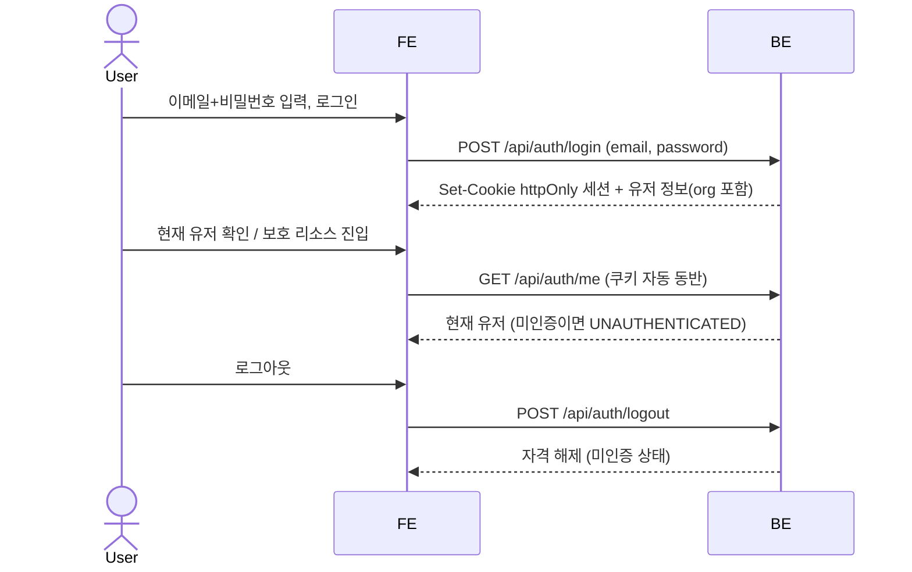
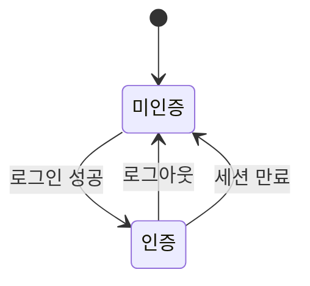

# SC-SPEC-03 유저

테스트 계정 5개를 시드로 두고, 이메일+비밀번호 로그인으로 유저를 식별하여 개인공간(SC-SPEC-02) 유저 격리의 근거를 보장한다.

> 기능/정책 묶음 단위의 **외부 계약**. client / QA / 외부 통합이 이 문서만 읽고 쓸 수 있어야 합니다.
> table schema 전문, ORM field, repository/service 구조는 본문에 두지 않습니다. 구현 중 DDD/schema 초안은 관련 WP, 실제 schema 는 코드/migration 이 SoT 입니다.

---

## 1. 개요 (Why)

### 메타

- Domain note: 외부에 드러나는 resource = 유저(테스트 계정 5개, 시드 사전 생성) + 인증 상태(미인증 ↔ 인증). 유저는 DB 테이블에 저장(email / password 해시 / 표시이름 / org 수준), 가입 플로우 없음. 외부 노출 상태 enum 은 인증 상태 수준만. 관련 WP = `work-03-user`(미착수).
- Open Questions: 없음 (전부 해소) — ~~SC-OPEN-07 (세션 메커니즘)~~ → 해소(httpOnly 쿠키 세션) · ~~SC-OPEN-08 (역할/권한 분기)~~ → 해소(v1 역할 동등) — §6 참조

### Business Requirement

- sc_demo 는 mediness 판매용 데모 앱이고, 개인공간(SC-SPEC-02)이 **유저별 read-write 작업실**이려면 "이 요청이 어느 유저인가"를 가르는 **유저 식별 모델**이 선행되어야 한다.
- 데모는 **테스트 계정 5개를 시드로 사전 탑재**하고, 방문자가 **이메일+비밀번호로 로그인**해 자기 자격으로 식별되는 경험을 확인할 수 있어야 한다 (가입 플로우는 없음).
- 본 SPEC 은 개인공간 SC-OPEN-04(유저 식별 모델)를 **로그인 세션 기반 유저 식별**로 닫는다 — 이 식별이 개인공간 유저 격리(자기 문서만)의 근거가 된다.

---

## 2. 사용자 경험 (What)

> **디자인 SoT**: `claude-design/onto/` — 인증 게이팅 `app.jsx`, 로그인 화면 `auth.jsx`(LoginScreen + 시드 계정), 워크스페이스 셸 푸터 `shell.jsx`, 토큰 `styles/tokens.css`·`styles/onto.css`. 아래는 이 디자인을 실측해 고정한 것이다.

### Placement

- **인증 게이트**: 미인증이면 앱(사이드바·3탭) 진입 전에 **로그인 화면이 전체 화면**으로 먼저 뜬다(`app.jsx` — user 없으면 LoginScreen, 있으면 Shell). 로그인 성공 후 워크스페이스 셸(SC-SPEC-05)로 진입.
- **로그인 화면**: 중앙 카드 — 브랜드(`mediness / 온톨로지 워크스페이스`), 제목 `로그인`, 안내문, 이메일/비밀번호 입력, `로그인` 버튼, 하단 푸터. **로그인은 이메일/비밀번호 직접 입력** — 시드 계정 quick-fill 목록·공통 비밀번호 노출은 두지 않는다(디자인 목업의 quick-fill 은 v1 에서 제외).
- **로그인 후 유저 노출**: 사이드바 **푸터**에 아바타 이니셜 + 표시이름 + `mediness / {org}` + 로그아웃 버튼.

#### Wireframe

```
┌──────────── 로그인 (전체 화면 게이트) ────────────┐
│              ┌────────────────────────┐           │
│              │ M  mediness            │           │
│              │    온톨로지 워크스페이스 │           │
│              │                        │           │
│              │ 로그인                 │           │
│              │ 가입 절차 없이 로그인   │           │
│              │ 이메일  [✉ name@test…] │           │
│              │ 비밀번호 [🔒 ••••••••] │           │
│              │ (오류 메시지)          │           │
│              │ [      로그인       ]  │           │
│              └────────────────────────┘           │
│                데모 · 5 테스트 계정 · 역할 동등     │
└────────────────────────────────────────────────────┘
   로그인 성공 → 사이드바 푸터: [T] Test 1 / mediness·test [로그아웃]
```

### UX Contract

- **화면 상태**: (1) **미인증**: 로그인 카드(이메일·비밀번호 빈 폼, 이메일 autofocus), (2) **입력 누락**: 빈 값 제출 시 인라인 에러, (3) **자격 불일치**: 로그인 실패 인라인 에러, (4) **인증**: 셸 진입 + 사이드바 푸터에 유저 표시, (5) **로그아웃**: 푸터 로그아웃 → 미인증(로그인 게이트 복귀).
- **문구**(디자인 실측):
  - 제목/안내: `로그인` / "가입 절차 없이 로그인하세요."
  - 라벨/placeholder: `이메일`(`name@test.com`) · `비밀번호`(`••••••••`)
  - 에러: 빈 값 = "이메일과 비밀번호를 입력하세요." / 자격 불일치 = "이메일 또는 비밀번호가 올바르지 않습니다."
  - 푸터: "데모 · 5 테스트 계정 · 역할 동등"
  - 버튼: `로그인`(submit), 사이드바 푸터 로그아웃(title `로그아웃`)
- **CTA**: (a) `로그인` 버튼 → 자격 검증·로그인, (b) 사이드바 푸터 로그아웃 → 세션 해제·게이트 복귀.
- **UX 기대 결과**: 가입 절차 없이 시드 계정의 이메일/비밀번호로 직접 로그인해 워크스페이스에 진입하고, 미인증 상태에서는 로그인 게이트가 앱 전체를 가린다. 잘못된 자격은 이메일 존재 여부를 구분하지 않는 단일 에러로 표시된다.

> 시드 계정 quick-fill(클릭 자동입력)·공통 비밀번호 노출은 **v1 제외**(PO 결정) — 로그인은 이메일/비밀번호 직접 입력만. (테스트 계정 5개는 시드로 존재하나 화면에 자동입력 목록을 노출하지 않는다.)
> 기능 케이스(어떤 동작이 어떤 결과를 내야 하는가)는 아래 User Scenario 가 SoT. 본 UX Contract 는 디자인 실측 시각/문구/배치를 고정한다.

### User Scenario

케이스별 시나리오. 각 줄 `{조건/동작} → {결과}`. 기능 계약이며 시각 표현은 §2 UX Contract 로 분리.

- (정상·로그인) 시드된 테스트 계정의 이메일+비밀번호로 로그인 → 인증 자격(세션/토큰) 발급, 인증 상태로 전환
- (정상·현재 유저) 인증 상태에서 현재 유저 조회 → 로그인한 유저(표시이름/식별자 수준) 반환
- (정상·로그아웃) 로그아웃 → 인증 자격 해제, 미인증 상태로 전환
- (비정상·잘못된 자격) 잘못된 이메일 또는 비밀번호로 로그인 → 인증 거부, 식별 실패 (case matrix `INVALID_CREDENTIALS`)
- (비정상·미인증 접근) 미인증 상태로 보호 리소스(개인공간 등) 접근 → 접근 차단 (case matrix `UNAUTHENTICATED`)
- (경계·세션 만료) 인증 자격이 만료된 뒤 보호 리소스 접근 → 미인증으로 간주, 접근 차단 (case matrix `UNAUTHENTICATED`)

> 전체 end-to-end 흐름은 §3 Flow 의 sequence diagram 으로 (여기선 케이스 나열에 집중).

---

## 3. 계약 (How — 인터페이스)

> 아래 Method/Path 는 인증(로그인/로그아웃/현재 유저)의 계약 모델이다. 구현 파일 경로/내부 핸들러명은 spec 범위 밖(WP/코드 SoT).
> 로그인 성공 시 발급하는 **인증 자격 = httpOnly 쿠키 세션** (SC-OPEN-07 해소). 서버가 세션을 만들고 httpOnly 쿠키로 내려, 이후 요청에 브라우저가 자동 동반한다. 만료 시간·쿠키 속성(SameSite 등)·세션 저장소 구체는 코드/WP SoT.

### API 계약

| Method | Path | 요약 | 권한 |
|---|---|---|---|
| POST | `/api/auth/login` | 이메일+비밀번호 검증 → 인증 자격 발급 | 공개 (미인증 호출) |
| POST | `/api/auth/logout` | 인증 자격 해제 (로그아웃) | 인증 유저 |
| GET | `/api/auth/me` | 현재 로그인한 유저 조회 (who am I) | 인증 유저 |

#### Request / Response 상세

**POST `/api/auth/login`** — 정상(200), 인증 성공:

```json
{
  "data": {
    "user": {
      "id": "<유저 식별자>",
      "email": "<이메일>",
      "display_name": "<표시이름>",
      "org": "<소속 (예: test)>"
    }
  }
}
```

- 요청 body: `email` + `password`.
- 성공 시 서버가 **세션을 생성하고 httpOnly 쿠키로 발급**한다(`Set-Cookie`). 응답 body 에 토큰 필드를 두지 않는다 — 자격은 쿠키로만 전달(SC-OPEN-07 해소).
- 응답 `user` 에 `org`(소속 표시)를 포함한다. 아바타 이니셜은 표시용 파생/시드 값으로 본 schema 에 별도 필드로 박지 않는다(FE 표시 altitude).
- 응답에 **역할/권한 정보는 포함하지 않는다** — v1 은 5 계정 동등 유저(§6 SC-OPEN-08).
- 자격 불일치 시 `INVALID_CREDENTIALS`.

**GET `/api/auth/me`** — 정상(200), 현재 유저:

```json
{
  "data": {
    "id": "<유저 식별자>",
    "email": "<이메일>",
    "display_name": "<표시이름>",
    "org": "<소속>"
  }
}
```

- 인증 상태(httpOnly 쿠키 동반)에서 호출 유저 본인의 식별 정보를 반환. 미인증 호출은 `UNAUTHENTICATED`.

**POST `/api/auth/logout`** — 정상(200 또는 204), 로그아웃:

- 서버가 세션을 무효화하고 쿠키를 만료시켜 미인증 상태로 전환. 응답 body 는 별도 데이터 없이 성공 표시 수준.

### Validation

> 입력 검증 규칙 — **어떤 입력이 valid 한가** 만. FE(즉시 피드백·UX) / BE(최종 신뢰 경계·보안) 가 같은 규칙을 각자 구현.
> 위반 시 에러코드·표시·위치는 케이스 매트릭스의 해당 행.

| 필드 | 규칙 |
|---|---|
| `email` (로그인) | 비어있지 않은 이메일 형식. 구체 길이/형식 제약은 코드 SoT (본문 미확정) |
| `password` (로그인) | 비어있지 않은 문자열. 비밀번호 정책(길이/복잡도)은 시드 계정 전제라 본문 미확정 — 코드 SoT |

> 입력 형식은 valid 하나 자격이 일치하지 않는 경우(존재하지 않는 이메일 / 틀린 비밀번호)는 검증 실패가 아니라 인증 실패 → `INVALID_CREDENTIALS` (보안상 이메일 존재 여부를 구분 노출하지 않음).

### 케이스 매트릭스

> **모든 에러/경계 케이스의 단일 SoT**. API 상세는 정상 응답만, 에러는 전부 여기. (프론트 출력 문구는 디자인 실측값.)

| 에러 코드 | 백엔드 출력 | 프론트 출력 | 표시 위치 |
|---|---|---|---|
| `INVALID_CREDENTIALS` | 401 | "이메일 또는 비밀번호가 올바르지 않습니다." (디자인 실측, 폼 인라인) | 로그인 폼 |
| `UNAUTHENTICATED` | 401 | 로그인 화면(게이트)으로 전환 — 별도 메시지 없이 로그인 카드 표시 | 앱 전체(인증 게이트) |

> 이메일 존재 여부를 구분하지 않고 로그인 실패를 단일 `INVALID_CREDENTIALS` 로 응답한다 (열거 공격 방지). 세션 만료는 별도 코드가 아니라 `UNAUTHENTICATED` 로 수렴.

### Flow

end-to-end 흐름 (sequence diagram).



### 상태 / Lifecycle

외부에 노출되는 인증 상태 transition (미인증 ↔ 인증) 수준만 둔다.



> 인증 자격 = **httpOnly 쿠키 세션**(SC-OPEN-07 해소). 만료 시간·쿠키 속성·세션 저장소 등 내부 표현은 외부 계약 밖 — WP / 코드 SoT.

---

## 4. 구현 규칙 (How — 내부)

### Frontend Implementation

> 리액트 구현 시작점. 인증 화면(로그인 폼)과 인증 상태 관리가 핵심. 구체 라우트·컴포넌트 파일·세션 저장 방식은 WP/코드 SoT — spec 에서 발명하지 않음.

- **라우트**: 코드/WP SoT. 디자인은 인증 게이팅(`app.jsx` — user 없으면 LoginScreen, 있으면 Shell)이라 별도 URL 라우트를 쓰지 않는다 — 실제 라우트 채택은 구현 결정.
- **페이지 / 레이아웃**: 로그인 카드(브랜드 + 이메일/비밀번호 폼 + 로그인 CTA). 시각 세부는 §2 UX Contract.
- **컴포넌트**:
  - 신규: 로그인 폼. (구체 컴포넌트/폼 라이브러리는 본문에 두지 않음. 시드 quick-fill 목록은 v1 제외.)
- **상태 (state)**: 인증 상태(미인증/인증) 및 현재 유저(서버 상태 — `GET /api/auth/me`). 인증 자격은 **httpOnly 쿠키**라 JS 가 직접 보관하지 않고 브라우저가 자동 동반한다.
- **데이터 연동**: §3 API 계약 — 로그인=`POST /api/auth/login`, 로그아웃=`POST /api/auth/logout`, 현재 유저=`GET /api/auth/me`

### Functional Rule

- **비밀번호 검증**: 로그인 시 입력 비밀번호를 저장된 자격(해시)과 대조해 인증. 불일치 시 `INVALID_CREDENTIALS` (이메일 존재 여부 비구분).
- **세션 유효성**: 보호 리소스 접근은 유효한 **httpOnly 쿠키 세션**을 요구한다. 미인증/만료 세션은 `UNAUTHENTICATED` 로 차단. (SC-OPEN-07 해소 — 쿠키 세션.)
- **유저 식별 = 개인공간 격리 근거**: 본 SPEC 의 로그인 세션이 개인공간(SC-SPEC-02) 유저 스코프/격리의 식별 근거다 (SC-SPEC-02 SC-OPEN-04 를 닫음).
- **역할 동등**: v1 은 5 테스트 계정이 동등 유저 — 역할/권한 분기 없음 (§6 SC-OPEN-08).
- v1 미포함: 회원가입/등록(시드만), 비밀번호 재설정, 이메일 인증, 프로필 편집.

### DB

유저는 **DB 테이블 `users`** 에 저장한다. 테스트 계정 5개는 **시드로 사전 생성**(가입 플로우 없음).

**테이블 `users`**

| 컬럼 | 타입(설계) | 키/제약 | 설명 |
|---|---|---|---|
| `id` | UUID 또는 serial | PK | 유저 식별자 (개인공간/채팅 FK 대상) |
| `email` | varchar | UNIQUE, NOT NULL | 로그인 이메일 |
| `password_hash` | varchar | NOT NULL | 해시된 비밀번호 (**평문 저장 금지**) |
| `display_name` | varchar | NOT NULL | 표시이름 (예: Test 1) |
| `org` | varchar | NOT NULL | 소속 (예: test) |
| `created_at` | timestamptz | NOT NULL, default now() | 생성 시각 |

- **시드 5행** (generic 테스트 계정 — 데모 전용):

  | email | password | display_name | org |
  |---|---|---|---|
  | `test1@test.com` | `test1admin` | Test 1 | test |
  | `test2@test.com` | `test2admin` | Test 2 | test |
  | `test3@test.com` | `test3admin` | Test 3 | test |
  | `test4@test.com` | `test4admin` | Test 4 | test |
  | `test5@test.com` | `test5admin` | Test 5 | test |

  비밀번호는 시드 시 해시로 저장(`password_hash`) — 평문 저장 금지. 위 평문값은 데모 로그인용 구체값이며, 해시 알고리즘은 코드 SoT.
- PK 타입(UUID/serial)·해시 알고리즘(bcrypt/argon2 등)·인덱스·migration 세부는 **코드/migration 최종 SoT** — 위 표는 설계(초안)이며 컬럼 의미를 고정한다.
- role 컬럼 없음 (v1 역할 동등, SC-OPEN-08).

---

## 5. 검증 (Verify)

### Acceptance Criteria

- [ ] 테스트 계정 5개(`test1@test.com`~`test5@test.com`)가 시드로 사전 생성되어 있다 (가입 플로우 없이 로그인 가능).
- [ ] 로그인 화면에 시드 계정 quick-fill 목록·공통 비밀번호가 노출되지 않는다 (이메일/비밀번호 직접 입력).
- [ ] 시드 계정의 이메일+비밀번호로 로그인하면 인증 자격이 발급되고 인증 상태로 전환된다.
- [ ] 인증 상태에서 현재 유저(who am I)를 조회할 수 있다.
- [ ] 로그아웃하면 인증 자격이 해제되고 미인증 상태가 된다.
- [ ] 잘못된 이메일/비밀번호로 로그인하면 `INVALID_CREDENTIALS` 로 거부되고, 이메일 존재 여부를 구분 노출하지 않는다.
- [ ] 미인증/세션 만료 상태로 보호 리소스에 접근하면 `UNAUTHENTICATED` 로 차단된다.
- [ ] 비밀번호는 평문이 아닌 해시로 저장된다.
- [ ] 본 로그인 세션이 개인공간(SC-SPEC-02) 유저 격리의 식별 근거로 동작한다.
- [ ] 로그인 성공 시 httpOnly 쿠키 세션이 발급되고, 이후 요청에 쿠키가 자동 동반된다.
- [x] §2 Placement / Wireframe / UX Contract 가 디자인(claude-design/onto) 기준으로 반영되었다.

---

## 6. Open Questions

- **SC-OPEN-07 (세션 메커니즘) — 해소(resolved)**: 인증 자격 = **httpOnly 쿠키 세션**으로 확정(PO 결정 2026-06-07). 서버가 세션을 만들고 httpOnly 쿠키로 발급, 브라우저가 자동 동반하며, 로그아웃은 서버가 세션 무효화 + 쿠키 만료로 처리한다. 디자인의 localStorage 보관은 프로토타입 throwaway 라 차용하지 않는다. 만료 시간·SameSite 등 쿠키 속성·세션 저장소(인메모리/redis 등)는 코드/WP SoT. §3 login/me/logout · §4 · Flow/Lifecycle 에 반영됨.
- **SC-OPEN-08 (역할/권한 분기) — 해소(resolved)**: v1 은 5 계정이 **동등 유저**(디자인 로그인 푸터 "역할 동등" 확인). 역할 분기 없음 — 응답 schema 에 role 없음. role 차등이 필요해지면 후속 WP.
- **(flag) org 필드**: 디자인이 nav 푸터에서 org 를 노출 → 유저 모델·`/api/auth/me`·`/api/auth/login` 응답에 `org` 포함(PO 결정). 시드 generic 계정의 org 는 `test`. 아바타 이니셜은 표시용 파생/시드 값으로 schema 필드로 박지 않음.
