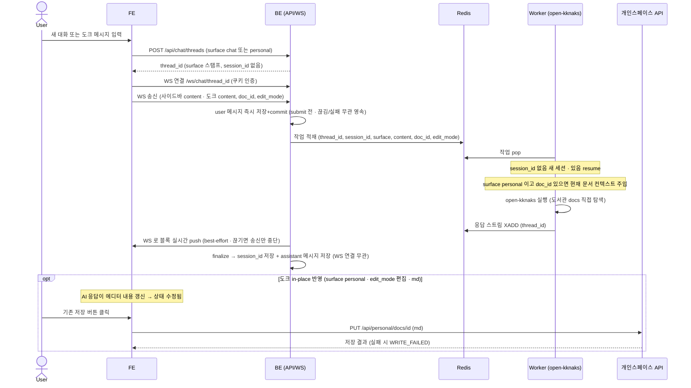

# SC-SPEC-04 채팅

서버에 설치된 Claude 를 **open-kknaks** 로 구동하는 멀티턴 AI 채팅 에이전트로, 채팅방마다 **WebSocket** 으로 연결한다. 채팅은 두 **surface** 로 동작한다 — **사이드바(surface=chat)** 는 도서관 문서를 직접 탐색해 인사이트를 주는 **탐색/Q&A 전용**(쓰기 없음), **도크(surface=personal)** 는 현재 열린 개인스페이스 문서를 컨텍스트로 작성 어시스턴스를 제공한다. surface 는 WebSocket 연결 단계에서 전달되어 thread 에 스탬프되고, 능력 정책(쓰기 허용/게이팅)을 가른다. 대화방 단위로 open-kknaks **세션을 resume** 하며 기록을 DB 에 저장한다.

> 기능/정책 묶음 단위의 **외부 계약**. client / QA / 외부 통합이 이 문서만 읽고 쓸 수 있어야 합니다.
> table schema 전문/ORM/repository 구조는 본문에 두지 않습니다(컬럼 설계는 §4 DB, 실제 타입/인덱스/migration 은 코드 SoT).

---

## 1. 개요 (Why)

### 메타

- Domain note: 외부에 드러나는 resource = 채팅 thread(대화방) + 메시지(유저 스코프). thread/메시지는 DB 에 저장(`chat_threads`/`chat_messages`). thread 는 Claude Code 세션 식별자(`session_id`, CLI 발급)와 **surface**(`chat`(사이드바)/`personal`(도크))를 보관 — surface 는 능력 정책을 가른다. AI 응답은 **서버 open-kknaks 로 구동**(큐·워커·Redis Streams 내장). 외부 노출 상태 enum 없음. 관련 WP = `work-04-chat`(미착수).
- Open Questions: 미해결 블로커 없음 — ~~SC-OPEN-10 (엔진 연동)~~ → open-kknaks+Redis+session resume+WS · ~~SC-OPEN-11 (작성 영속)~~ → 사이드바 쓰기없음 / 도크 편집모드+md in-place 반영+기존 저장 재사용 · ~~SC-OPEN-12 (응답 방식)~~ → WebSocket 스트리밍 · ~~SC-OPEN-13 (MCP)~~ → 제거(데모는 서버 직접 파일 탐색) · **SC-OPEN-14 (생성 중 재진입 UX) → deferred**(방향=WS 재연결/late-join, 구현은 추후 WP) — §6 참조

### Business Requirement

- sc_demo 는 mediness 판매용 데모 앱이고, 도서관(SC-SPEC-01)·개인스페이스(SC-SPEC-02)·유저(SC-SPEC-03)가 각각의 공간/계약이라면 **채팅은 이 셋을 묶는 AI 레이어**다.
- 채팅 에이전트는 **서버에 설치된 Claude 를 open-kknaks 로 구동**(서버사이드 Claude Code PTY 실행)하는 멀티턴 대화 에이전트로, 유저별(SC-SPEC-03 로그인 세션 스코프)로 동작한다. **open-kknaks·Redis 는 필수 인프라**다.
- **MCP 불필요(데모)**: open-kknaks 는 우리 서버 안에서 돌고, Claude Code 네이티브 파일 도구로 **도서관 docs 디렉토리를 직접 탐색**한다(외부에서 들어오는 접근이 아니라 우리 코드 내 파일 탐색). 별도 MCP 서버 레이어를 두지 않는다.
- 데모 방문자가 채팅으로 확인할 두 surface 의 역할:
  1. **사이드바(surface=chat) — 도서관 문서를 읽고 인사이트**: 읽기전용 시드(SC-SPEC-01) docs 를 직접 탐색해 요약/인사이트/질의응답. **쓰기(대신작성/문서생성) 없음 — 탐색/Q&A 전용.**
  2. **도크(surface=personal) — 현재 문서 작성 어시스턴스**: 개인스페이스에서 현재 열린 문서를 컨텍스트로, **편집 모드 + md 문서일 때만** AI 가 현재 문서에 **in-place 반영**(에디터 내용 갱신). 보기 모드 또는 비-md 는 **의견/답변만**. **데모 범위 = md 작성만.**
- ★ **쓰기 경계(md 한정 + surface 게이팅)**: 개인스페이스(SC-SPEC-02)이 4포맷 업로드·보기를 지원하더라도 **인앱 저작은 md 전용**이며, 채팅의 작성 어시스턴스도 **도크(surface=personal) + 편집 모드 + md 문서**일 때만 발생한다. 에이전트는 docx/xlsx/pdf 를 저작하지 않고, 사이드바(surface=chat)에선 어떤 쓰기도 하지 않는다. AI 의 in-place 반영은 에디터 내용을 갱신할 뿐(상태 `수정됨`), 영속은 유저가 기존 `저장` 버튼(`PUT /api/personal/docs/{id}`, SC-SPEC-02)을 눌러야 일어난다 — AI 가 자동 저장하지 않으며 신규 write 경로 발명 없음.
- **채팅은 두 surface**: ① 사이드바 풀스크린(surface=chat, thread 기반 대화방, **도서관 문서 탐색/Q&A 전용**) ② 개인스페이스 우측 도크(surface=personal, **현재 문서 컨텍스트 + 편집모드 in-place 작성 어시스턴스**). 둘 다 동일한 open-kknaks/WebSocket/세션 엔진을 공유하며, surface 가 능력 정책을 가른다.

---

## 2. 사용자 경험 (What)

> **디자인 SoT**: `claude-design/onto/` — 채팅 `chat.jsx`(풀스크린 `Chat` + 도크 `DockChat` + 공통 `Conversation`/`Composer`/`Message`/`DraftCard`/`Citations`), 셸 `shell.jsx`, 개인스페이스 도크 마운트 `myspace.jsx`, 토큰 `styles/tokens.css`·`styles/onto.css`. 아래는 이 디자인을 실측해 **v1 경계**로 고정한 것이다.
> v1 단순화(디자인엔 있으나 제외): **파일첨부(📎)·@멘션·MCP tool 카드** — 도서관 그라운딩은 에이전트의 직접 문서 탐색으로 갈음한다(기본 기능).

### Placement

- 채팅은 **두 곳에 배치**된다:
  1. **풀스크린** — 사이드바 `채팅` 탭. **2-컬럼**: 좌측 대화(thread) 목록 패널(상단 `새 대화` + `대화 검색` + 그룹별 thread 목록) / 우측 대화 영역(메시지 스트림 + 하단 컴포저).
  2. **도크 (surface=personal)** — 개인스페이스(SC-SPEC-02) 우측 IDE식 패널. 개인스페이스 chrome 의 `AI` 토글로 열고 닫는다. 헤더(`AI 어시스턴트` + 닫기) + 근거 라인(`근거: {현재 문서}`) + 대화 스트림 + 도크 컴포저. **현재 열린 문서를 컨텍스트로** 작성 어시스턴스를 제공하며, **편집 모드 + md 문서**일 때만 AI 가 현재 문서에 in-place 반영한다.
- **두 배치 모두 thread 기반(대화 기록 + 새 대화)** — 동일한 대화 컴포넌트(메시지 스트림 + 컴포저)와 thread 모델을 공유하고, **surface 가 능력을 가른다**.
  - 풀스크린(surface=chat): 좌측 thread 목록 패널(`새 대화` + 기록). 탐색/Q&A 전용.
  - 도크(surface=personal): 헤더에 **`새 대화` + 대화 기록(컴팩트 switcher)**. 매번 들어올 때 마지막 대화를 이어가거나 새로 시작한다 — 단일 대화로 고정되지 않고, 매번 새로 시작하지도 않는다. in-place 작성 어시스턴스 제공.
- **Cursor 식 컨텍스트(도크)**: thread 는 지속되고, **메시지마다** "현재 보고 있는 문서(`doc_id`) + 모드(`edit_mode`) + 그 문서 내용"을 컨텍스트로 실어 보낸다. 대화 중 다른 문서로 옮기면 그 순간의 페이지/모드가 따라간다(그래서 doc_id/edit_mode 는 thread 가 아니라 메시지 런타임).
> ※ 디자인 `DockChat` 은 단일 대화(기록/새 대화 없음)지만, v1 은 도크에도 thread 기록 + 새 대화를 둔다(디자인 대비 보강 — 도크 thread = surface=personal).

#### Wireframe

```
─ 풀스크린 (사이드바 "채팅" 탭) ────────────────────────────────────
┌─ thread 목록 ──────┬──────────── 대화 ─────────────────────────┐
│ [+ 새 대화]        │  민 김민준                    14:18        │
│ 🔍 대화 검색       │   온톨로지 개요 신뢰도는…                 │
│ ─ 오늘 ─           │  ✦ Claude            14:18 · open-kknaks  │
│ ▸ 당뇨 매핑 신뢰도 │   도서관 시드 문서를 읽어 확인했습니다.    │
│   …14:18 · 4개     │   매핑 신뢰도 요약 …                       │
│ ▸ 백서 2장 요약    │   [1] 온톨로지 개요.md · 개념모델 L24      │
│ ─ 이번 주 ─        │                                            │
│ ▸ 고혈압 관계 정리 │ ┌────────────────────────────────────────┐ │
│ ▸ LOINC 매핑 초안  │ │ 무엇이든 물어보세요                     │ │
│                    │ │ ● open-kknaks                  [전송]  │ │
└────────────────────┴─└────────────────────────────────────────┘─┘

─ 도크 (개인스페이스 우측, AI 토글 · surface=personal) ─────
┌ ✦ AI 어시스턴트          🕐  +  ✕ ┐   🕐=대화 기록 · +=새 대화 · ✕=닫기
│ 📄 근거: 주간 업무 메모 (편집중)  │
│ ┌── 대화 기록 (🕐 드롭다운) ───┐ │
│ │ + 새 대화                    │ │
│ │ 🕐 분기 메모 핵심 정리  오늘 │ │
│ │    주간 업무 메모에서 핵심…  │ │
│ │ 🕐 md 초안 작성 요청    어제 │ │
│ │    회의 결론을 md 초안으로…  │ │
│ └──────────────────────────────┘ │
│  ✦ Claude  현재 문서를 근거로…   │
│  (편집모드+md → 현재 에디터에     │
│   in-place 반영, 상태 수정됨;     │
│   저장은 기존 [저장] 버튼)        │
│ [현재 문서를 근거로 질문…]  전송  │
│ ● open-kknaks                     │
└───────────────────────────────────┘
(보기 모드 또는 비-md 문서 → 의견/답변만, 현재 문서에 쓰지 않음)
```

### UX Contract

- **화면 상태**: (1) **thread 목록**(풀, surface=chat): 그룹(`오늘`/`이번 주`)별 thread 카드(제목·snippet·시각·메시지 수), 선택 active, (2) **대화 스트림**: user/assistant 메시지 교차(아바타·이름·시각), (3) **응답 생성 중**: assistant `생각 중…` + 타이핑 caret → WebSocket 으로 토큰 실시간 추가. **이 표시는 해당 WS 세션(라이브) 한정** — 다른 탭에 갔다 **생성 중**에 돌아오면 "생성 중" 상태는 자동 복원되지 않는다(`GET /threads/{id}` 는 **완료된 턴만** 반환). 재진입 시 진행 중 응답을 이어 스트리밍하는 것은 **미지원(추후 — §6 SC-OPEN-14 WS 재연결)**, (4) **응답**: 텍스트/리스트 + **인용**(번호+문서+위치). **사이드바(surface=chat)는 여기까지 — 탐색/Q&A 전용, 쓰기 카드 없음.** (5) **도크 in-place 반영**(surface=personal): 편집 모드 + md 문서 질문 시 AI 가 **현재 에디터 내용을 갱신**하고 저장 상태가 `수정됨` 으로 전환된다(AI 자동 저장 없음, 영속은 기존 `저장` 버튼). 보기 모드/비-md 는 의견·답변만, (6) **도크 근거**: 근거 문서 표시(`근거: {문서}` / 없으면 "선택된 문서 없음").
- **문구**(디자인 실측, v1 경계):
  - thread: `새 대화`, `대화 검색`, 그룹 `오늘`/`이번 주`
  - 컴포저 placeholder: 풀 = "무엇이든 물어보세요" / 도크 = "현재 문서를 근거로 질문…"
  - 모델 표시: `● open-kknaks`, 전송 = `전송`(⌘/Ctrl+Enter)
  - assistant 표기: 이름 `Claude`, 메타 `{시각} · open-kknaks`, 생성 중 `생각 중…`
  - 도크: 헤더 `AI 어시스턴트`, 근거 `근거: {문서}` (편집/보기 모드 표시), 노트 `에이전트는 md 만 작성합니다`
  - 도크 in-place 반영: 편집 모드 + md 일 때 AI 가 에디터 내용 갱신 → 저장 상태 `수정됨`(SC-SPEC-02 chrome). 저장은 개인스페이스 기존 `저장` 버튼 사용 — 채팅이 별도 저장 버튼을 두지 않는다
  - (v1 제외) @멘션 칩·파일첨부(📎)·MCP pill·MCP tool 카드
- **CTA**: (a) 메시지 전송(`전송`/⌘Enter, **WebSocket 송신** — 사이드바 `(content)`, 도크 `(content, doc_id, edit_mode)`), (b) `새 대화` → 새 대화방 생성(사이드바=surface=chat / 도크=surface=personal), (c) thread 선택(사이드바 목록 또는 도크 기록) → 이력 표시(DB 조회), (d) 도크 편집모드+md 질문 → AI 가 현재 문서에 in-place 반영(에디터 갱신, 상태 `수정됨`); 영속은 개인스페이스 기존 `저장` 버튼(SC-SPEC-02 `PUT /api/personal/docs/{id}`), (e) 도크 `AI` 토글/닫기.
- **UX 기대 결과**: 유저는 도서관 문서를 근거로(인용 표시) 멀티턴 대화하고, 응답은 WebSocket 으로 실시간 흘러 들어온다. 사이드바는 탐색/Q&A 만 한다. 도크에서는 현재 열린 문서를 컨텍스트로 어시스턴스를 받으며, **편집 모드 + md 문서**일 때 AI 가 현재 문서에 직접 반영하고(에디터 `수정됨`), 유저가 기존 `저장`을 눌러 확정한다. **보기 모드/비-md 는 답변만** 받는다.

> 인용(citation)은 에이전트가 탐색한 도서관 문서의 출처 표시다. 기능 케이스(어떤 동작이 어떤 결과를 내야 하는가)는 아래 User Scenario 가 SoT.

### User Scenario

케이스별 시나리오. 각 줄 `{조건/동작} → {결과}`. 기능 계약이며 시각 표현은 §2 UX Contract 로 분리.

- (정상·새 대화) `새 대화` → 새 대화방(thread) 생성(surface=chat), WebSocket 연결. 첫 메시지 전송 → open-kknaks **새 세션**(resume 없음) 시작
- (정상·사이드바 질의) 사이드바(surface=chat)에서 도서관 문서 질문 전송 `(content)` → 에이전트가 도서관(읽기전용 시드)을 **직접 탐색**해 요약/인사이트로 응답 (WebSocket 실시간, 출처 인용). **쓰기 없음 — 탐색/Q&A 전용**
- (정상·멀티턴) 같은 방에서 후속 질문 → thread 의 `session_id` 로 open-kknaks 세션 **resume**, 맥락 유지하며 이어서 응답
- (정상·도크 컨텍스트) 도크(surface=personal)에서 질문 전송 `(content, doc_id, edit_mode)` → 현재 열린 문서 내용이 항상 컨텍스트로 AI 에 전달됨(보기/편집 무관)
- (정상·도크 in-place 반영) **편집 모드 + md 문서**에서 "하반기 보고서 작성해줘" → AI 가 **그 문서(에디터 내용)에 직접 반영**, 상태 `수정됨` → 유저가 기존 `저장` 버튼으로 확정 (SC-SPEC-02 `PUT /api/personal/docs/{id}` 재사용, AI 자동 저장 없음)
- (정상·도크 답변만) **보기 모드** 또는 **비-md 문서**에서 "이 숫자 맞아?" → AI 가 **의견/답변만** 제시, 현재 문서에 쓰지 않음
- (정상·thread 목록/조회) 채팅 진입 → 내 대화방 목록 / 방 선택 → DB 에서 메시지 이력 조회
- (비정상·미인증) 미인증 상태로 채팅/WebSocket 연결 시도 → 차단 (case matrix `UNAUTHENTICATED`)
- (비정상·엔진 실패) open-kknaks 실행 실패 → 응답 실패 표시 (case matrix `ENGINE_ERROR`). 이 턴의 **user 메시지는 보존**되고(송신 즉시 영속) assistant 만 미저장 — `GET /threads/{id}` 에 내가 보낸 메시지는 남는다
- (비정상·엔진 타임아웃) 시간 내 미응답 → 타임아웃 표시 (case matrix `ENGINE_TIMEOUT`)
- (비정상·쓰기 실패) 도크 in-place 반영 후 개인스페이스 저장(`PUT /api/personal/docs/{id}`) 실패 → 쓰기 실패 표시 (case matrix `WRITE_FAILED`)

> 전체 end-to-end 흐름은 §3 Flow 의 sequence diagram 으로 (여기선 케이스 나열에 집중).

---

## 3. 계약 (How — 인터페이스)

> 채팅은 **WebSocket(방 채널, 송·수신) + REST(대화방 생성/목록/이력)** 로 나뉜다. 유저 식별 = **SC-SPEC-03 httpOnly 쿠키 세션**(WebSocket 연결도 동일 쿠키로 인증).
> AI 응답은 **서버 open-kknaks 로 구동**한다. **큐·워커·Redis 는 open-kknaks 에 내장**(AgentClient 프로듀서 + RedisBroker + ClaudeWorker 컨슈머) — 우리가 큐/워커를 짜지 않는다. 전송은 **Redis Streams(XADD/XREAD)** 이며(pub/sub 아님, 리플레이/late-join 가능), 우리는 그 위에 **WebSocket 엔드포인트(`client.stream` 래핑)** 와 **thread↔session_id 매핑 DB** 만 얹는다. submit/result 호출 와이어·max_turns/model·Worker 토폴로지·서버 claude CLI 인증·작업 디렉토리 스코핑 등 세부는 §6 SC-OPEN-10 + WP.

### 엔진/세션 모델 (핵심)

- **대화방(thread) ↔ Claude Code 세션 = 1:1**. thread 가 그 세션의 `session_id` 를 보관한다.
- **session_id 는 Claude Code CLI 가 발급**한다 (open-kknaks 라이브러리·호출자 주입 불가). 따라서 **첫 메시지(turn 1) 완료 후에야 존재**한다 — 서버는 turn 1 응답의 `result_session_id` 를 받아 `chat_threads.session_id` 에 저장한다.
- **첫 메시지 = 새 세션(resume 없음, submit 만)**, **이어가기 = 저장된 `session_id` 로 resume**(`options.resume={mode: session, session_id}` → `claude -p --resume`). 멀티턴 맥락은 Claude Code 의 디스크 세션 transcript 가 유지한다(라이브러리 메모리 아님).
- **resume 보장 = 단일 워커(확정)**: 세션 transcript 파일은 워커 로컬에 있고, **워커가 하나뿐**이라 모든 resume 이 같은 워커에서 실행되어 항상 세션을 찾는다. (워커 재시작 후에도 보존하려면 `~/.claude/projects` 볼륨 마운트 — 선택. 스케일아웃 시 sticky/공유볼륨은 후속 WP — §6 SC-OPEN-10.)
- **그라운딩 = 직접 파일 탐색**: open-kknaks 는 Claude Code 네이티브 파일 도구로 **도서관 docs 디렉토리(읽기전용)** 를 직접 읽는다. 도크(surface=personal)에서는 메시지마다 전달된 `doc_id` 로 **현재 열린 개인스페이스 문서 내용을 컨텍스트로 제공**한다(보기/편집 무관). MCP 서버 없음. (작업 디렉토리 스코핑/샌드박싱은 코드/WP.)
- **surface 스탬프**: surface(`chat`/`personal`)는 thread 생성 시 결정되어 `chat_threads.surface` 에 저장된다(NOT NULL). 사이드바에서 연 채팅은 `chat`, 개인스페이스 도크에서 연 채팅은 `personal`. surface 가 쓰기 능력/게이팅을 가른다.
- **메시지 런타임 컨텍스트(thread 저장 X)**: 도크 대화 중 열린 문서/모드가 바뀔 수 있으므로 `doc_id`·`edit_mode` 는 thread 에 저장하지 않고 **WS 송신 메시지마다 전달**한다. thread 엔 surface 만 스탬프된다.

### API 계약 (REST)

| Method | Path | 요약 | 권한 |
|---|---|---|---|
| POST | `/api/chat/threads` | 새 대화방(thread) 생성 (`surface` body 필수, session_id 미발급 상태) | 유저 본인 (쿠키 세션) |
| GET | `/api/chat/threads` | 내 대화방 목록 조회 — 유저 스코프 (surface 로 분리: 사이드바=`chat`, 도크=`personal`) | 유저 본인 (쿠키 세션) |
| GET | `/api/chat/threads/{id}` | 대화방 단건 조회 (메시지 이력 — DB) | 유저 본인 (쿠키 세션) |

### WebSocket 계약

| 채널 | 방향 | 요약 |
|---|---|---|
| `WS /ws/chat/{thread_id}` | 양방향 | 대화방 채널. 메시지 **송신** + 에이전트 응답 **실시간 수신**. 쿠키 세션 인증, 본인 소유 thread 만. thread 의 surface 가 능력 정책을 결정 |

- **client → server** (송신) — surface 별로 페이로드가 다르다:
  - **사이드바 (surface=chat)**: `{ "content": "<메시지 텍스트>" }`. 탐색/Q&A 전용, 문서 컨텍스트/쓰기 없음.
  - **도크 (surface=personal)**: `{ "content": "<메시지 텍스트>", "doc_id": "<현재 열린 문서 식별자>", "edit_mode": "편집 | 보기" }`. `doc_id`·`edit_mode` 는 **메시지마다 전달**(thread 저장 X — 도크에서 열린 문서/모드가 바뀔 수 있어서). 서버는 `doc_id` 로 현재 문서 내용을 컨텍스트로 AI 에 전달하고, `edit_mode=편집` + md 문서일 때만 in-place 반영을 허용한다.
- **server → client** (수신, 스트리밍): 에이전트 응답을 **블록 이벤트**로 실시간 전송 — 텍스트 토큰, 인용, (도크 편집모드+md 시) 현재 문서 in-place 반영 결과, 완료 신호. 와이어 프레임 schema(이벤트 타입 명세)는 코드/WP SoT — 본 계약은 "블록 단위 실시간 스트림" altitude.
- **메시지 영속(끊김 내성)**: user 메시지는 **송신 즉시 영속**(엔진 호출 전 `chat_messages` role=user INSERT+commit), assistant 메시지는 **응답 완료 시 영속**하되 **WS 연결과 무관**하다(엔진이 canonical 을 만들면 클라이언트가 끊겨도 서버가 finalize 후 저장 — DB 가 SoT). 따라서 송신 직후 `GET /threads/{id}` 에 **user 메시지가 즉시 보이고**, 응답 완료 후 assistant 가 새 row 로 추가된다("세트로 완료 시점에만 저장"이 아니다). 엔진 에러 턴은 **user 메시지는 남고**(내가 보낸 건 보존) assistant 만 미저장 + `ENGINE_ERROR` 이벤트. (코드 grounding: PLAN-105-T-009 `f432331` — delta 도중 끊고 6s 후 user/assistant DB 저장 라이브 검증; user 즉시 저장 PLAN-105-T-010.)

#### Request / Response 상세 (REST)

**POST `/api/chat/threads`** — 요청 body: `{ "surface": "chat | personal" }`. 정상(201):

```json
{ "data": { "id": "<thread 식별자>", "title": null, "surface": "chat | personal", "created_at": "<ISO8601>" } }
```

- 빈 대화방을 만든다. **`surface` 는 생성 시 필수**(NOT NULL 스탬프) — FE 가 채팅을 연 위치(사이드바=`chat` / 개인스페이스 도크=`personal`)로 결정한다. `session_id` 는 아직 없음(Claude Code CLI 가 turn 1 완료 후 발급 → 저장). `title` 은 첫 메시지/요약으로 후속 채워질 수 있음. `doc_id`/`edit_mode` 는 thread 에 저장하지 않고 WS 메시지 런타임으로 전달된다.

**GET `/api/chat/threads`** — 정상(200):

```json
{
  "data": {
    "items": [
      { "id": "<thread 식별자>", "title": "<대화 제목/요약>", "surface": "chat | personal", "updated_at": "<ISO8601>", "created_at": "<ISO8601>" }
    ]
  }
}
```

- 유저 스코프: 호출 유저 본인의 대화방만 반환. `session_id` 는 내부 식별자라 응답에 노출하지 않으나, **`surface` 는 FE-facing 능력 속성**이라 노출한다(재접속 시 페이로드 shape 결정 근거).
- **surface 로 목록을 가른다** — 사이드바는 `surface=chat`, 도크는 `surface=personal` thread 만 표시한다(서로 새지 않게). 둘 다 자기 surface 의 **대화 기록 + 새 대화**를 갖는다. 필터 방식(쿼리 파라미터 `?surface=` vs 클라이언트 필터)은 코드 SoT.

**GET `/api/chat/threads/{id}`** — 정상(200), 메시지 이력:

```json
{
  "data": {
    "id": "<thread 식별자>",
    "surface": "chat | personal",
    "messages": [
      { "id": "<메시지 식별자>", "role": "user | assistant", "content": "<메시지 텍스트/블록>", "created_at": "<ISO8601>" }
    ]
  }
}
```

- `surface` 를 함께 반환해 **재접속 시 FE 가 WS 페이로드 shape**(사이드바 `(content)` / 도크 `(content, doc_id, edit_mode)`)를 결정한다. `doc_id`/`edit_mode` 는 메시지 런타임이라 이력에 저장/반환하지 않는다(Decision D).
- 타 유저 thread 접근은 차단(유저 스코프 = SC-SPEC-03 세션). 미인증은 `UNAUTHENTICATED`.

### Validation

| 필드 | 규칙 |
|---|---|
| `surface` (POST 생성) | `chat` 또는 `personal`. 필수(NOT NULL 스탬프). 그 외 값 거부 |
| `content` (WS 송신) | 비어있지 않은 텍스트. 길이/토큰 제한은 코드 SoT |
| `doc_id` (WS 송신, 도크) | surface=personal 일 때 현재 열린 문서 식별자. 본인 소유 문서(SC-SPEC-02). 메시지 런타임(thread 저장 X) |
| `edit_mode` (WS 송신, 도크) | surface=personal 일 때 `편집` 또는 `보기`. in-place 반영은 `편집`+md 문서일 때만. 메시지 런타임 |
| `thread_id` (WS 경로) | 호출 유저 본인 소유 thread. 타 유저 thread 연결은 차단 |

### 케이스 매트릭스

> **모든 에러/경계 케이스의 단일 SoT**.

| 에러 코드 | 백엔드 출력 | 프론트 출력 | 표시 위치 |
|---|---|---|---|
| `UNAUTHENTICATED` | 401 (REST) / 연결 거부(WS) | 로그인 게이트로 전환 (SC-SPEC-03) | 채팅 진입/WS 연결 |
| `ENGINE_ERROR` | WS 에러 이벤트 | "응답을 생성하지 못했습니다" | 대화 영역 |
| `ENGINE_TIMEOUT` | WS 에러 이벤트 (타임아웃) | "응답이 지연되어 중단되었습니다" | 대화 영역 |
| `WRITE_FAILED` | 400/500 (개인스페이스 PUT 저장 실패) | "문서 저장에 실패했습니다" | 개인스페이스 에디터/저장 영역 |

> `UNAUTHENTICATED` 는 SC-SPEC-03 코드 재사용. `ENGINE_ERROR`/`ENGINE_TIMEOUT` 은 WebSocket 에러 이벤트로 전달(타임아웃 임계/재시도는 코드/WP SoT). `WRITE_FAILED` 는 도크 in-place 반영 후 유저가 기존 `저장`(SC-SPEC-02 `PUT /api/personal/docs/{id}`)을 눌렀을 때 저장 실패 시 — 개인스페이스 저장 경로의 에러로, SC-SPEC-02 cross-ref.

### Flow

end-to-end 흐름 (sequence diagram).



### 상태 / Lifecycle

해당 없음 — v1 은 대화방/메시지 저장과 멀티턴 대화만 다루며 외부 노출 상태(enum)/transition 을 두지 않는다.

---

## 4. 구현 규칙 (How — 내부)

### Frontend Implementation

> 리액트 구현 시작점. 채팅 인터페이스(메시지 입력 + 멀티턴 스트림)는 신규 역량. 구체 라우트·컴포넌트 파일·WS 클라이언트 구현은 WP/코드 SoT.

- **라우트**: 코드/WP SoT. 디자인은 SPA 탭 전환(사이드바 `active`)이라 URL 라우트를 쓰지 않는다.
- **페이지 / 레이아웃**: (풀) thread 목록 + 메시지 스트림/컴포저 2-컬럼, (도크) 개인스페이스 우측 패널. 시각 세부는 §2 UX Contract.
- **컴포넌트**:
  - 신규(greenfield): thread 목록(사이드바), 메시지 스트림(블록 렌더 — 텍스트/리스트/인용), 컴포저(첨부·멘션 없음), **WebSocket 클라이언트**(방 채널 송·수신, 실시간 블록 렌더). surface 별 페이로드 분기(사이드바 `(content)` / 도크 `(content, doc_id, edit_mode)`).
  - 도크(surface=personal): 현재 열린 문서의 `doc_id`·`edit_mode` 를 메시지마다 실어 보냄. 편집모드+md 응답은 **SC-SPEC-02 에디터 내용을 갱신**(상태 `수정됨`) — 별도 저장 버튼/초안 카드 없음. 저장은 개인스페이스 기존 `저장` 버튼(`PUT /api/personal/docs/{id}`).
- **상태 (state)**: 현재 thread/메시지 이력(REST `GET /threads/{id}`), thread 의 surface, WebSocket 연결·수신 스트림(실시간), 전송 중 상태(로컬). 도크의 현재 문서/모드는 개인스페이스(SC-SPEC-02) 런타임 상태에서 읽어 메시지마다 전달. 인증 상태는 SC-SPEC-03.
- **데이터 연동**: WebSocket = `WS /ws/chat/{thread_id}`(송·수신), REST = 생성 `POST /threads`(surface body) · 목록 `GET /threads` · 이력 `GET /threads/{id}`.

### Functional Rule

- **surface 정책(핵심)**: 채팅은 두 surface(`chat`/`personal`)로 동작한다. surface 는 thread 생성 시 결정·스탬프되고(`chat_threads.surface`, NOT NULL), 능력을 가른다 — **사이드바(chat) = 탐색/Q&A 전용(쓰기 없음)**, **도크(personal) = 현재 문서 컨텍스트 + 편집모드 in-place 작성 어시스턴스**. `doc_id`/`edit_mode` 는 thread 에 저장하지 않고 WS 메시지마다 전달한다(도크에서 열린 문서/모드가 바뀔 수 있으므로 메시지 런타임).
- **도크 작성 게이팅**: surface=personal 에서 현재 열린 문서 내용은 **항상 컨텍스트로 AI 에 전달**(보기/편집 무관). 단 ① `edit_mode=편집` + **md 문서**일 때만 AI 가 **현재 문서에 in-place 반영**(에디터 내용 갱신 → 상태 `수정됨`, 유저가 기존 `저장`으로 확정, AI 자동 저장 없음), ② `edit_mode=보기` 또는 **비-md 문서**면 AI 는 **의견/답변만** 하고 현재 문서에 쓰지 않는다.
- **엔진 = open-kknaks(필수)**: AI 응답은 서버 open-kknaks(Claude Code PTY)로 구동한다. **큐·워커·Redis 는 open-kknaks 내장**(우리가 안 짠다) — 우리는 WebSocket 엔드포인트(`client.stream` 래핑) + thread↔session 매핑 DB 만 얹는다. 전송은 Redis Streams(pub/sub 아님).
- **세션/멀티턴**: 대화방 ↔ Claude Code 세션 1:1. session_id 는 **Claude Code CLI 가 발급**(turn 1 완료 후 `result_session_id`) → `chat_threads.session_id` 보관. 첫 메시지 = 새 세션(resume 없음), 이어가기 = 저장된 session_id resume. 멀티턴 맥락은 Claude Code 디스크 세션 transcript 의존 → **단일 워커로 resume 보장**(SC-OPEN-10).
- **응답 텍스트 중복 주의**: open-kknaks 스트림은 delta·assistant·result 텍스트를 모두 `text` 이벤트로 평탄화한다 → WS 로 흘릴 땐 **delta=타이핑 표시용, canonical 본문=`result().result`** 로 분리해 중복 렌더를 막는다(DB 저장 본문도 canonical).
- **응답 전달 = WebSocket 스트리밍**: 응답은 방 WebSocket 으로 블록 단위 실시간 전송(best-effort) + **완료 시 assistant 저장(WS 연결 무관 — 끊겨도 finalize 후 영속)**. user 메시지는 송신 즉시 별도 영속(§3 메시지 영속). (동기 폐기.)
- **그라운딩 = 직접 파일 탐색(MCP 없음)**: 에이전트는 Claude Code 네이티브 파일 도구로 **도서관 docs(SC-SPEC-01, 읽기전용)** 디렉토리를 직접 탐색해 응답을 근거화한다(출처 인용). 도크(surface=personal)에서는 메시지마다 전달된 `doc_id` 로 **현재 개인스페이스 문서**를 컨텍스트로 받아 작성 어시스턴스를 제공한다. 별도 MCP 서버를 두지 않으며(데모는 우리 코드 내 파일 탐색), 작업 디렉토리 스코핑/샌드박싱은 코드/WP. mediness 고유 입력원(회의 transcript 등)은 범위 밖.
- ★ **쓰기 경계(md 한정 + surface 게이팅)**: 사이드바(surface=chat)는 쓰기 없음. 도크(surface=personal)의 작성 어시스턴스는 **편집 모드 + md 문서**일 때만 현재 문서에 in-place 반영하며, 개인스페이스 영속은 **유저가 기존 `저장` 버튼을 눌러** `PUT /api/personal/docs/{id}`(SC-SPEC-02)로 일어난다(AI 자동 저장 없음, 채팅 전용 write 경로 없음). docx/xlsx/pdf 저작 안 함.
- **유저 스코프**: 대화방/메시지는 유저별 격리 — 본인 thread 만 조회/이어가기/WS 연결. 유저 식별 = SC-SPEC-03 쿠키 세션. 미인증은 `UNAUTHENTICATED`.
- **엔진 실패 처리**: open-kknaks 실행 실패 = `ENGINE_ERROR`, 시간 내 미응답 = `ENGINE_TIMEOUT`(WS 에러 이벤트). 임계/재시도 구체는 SC-OPEN-10/WP.
- v1 미포함: 파일첨부·@멘션·MCP 서버, mediness 로컬 npm 에이전트 구동, 에이전트의 docx/xlsx/pdf 저작, mediness 고유 입력원.

### DB

채팅 **thread/메시지는 DB 테이블 2개**에 저장한다. AI 응답 본체는 open-kknaks 가 생성하고, DB 엔 대화 기록만 남는다.

**테이블 `chat_threads`**

| 컬럼 | 타입(설계) | 키/제약 | 설명 |
|---|---|---|---|
| `id` | UUID 또는 serial | PK | 대화방(thread) 식별자 |
| `user_id` | (users.id) | FK→users, NOT NULL | 소유 유저 (유저 격리, SC-SPEC-03) |
| `title` | varchar | NULL 허용 | 대화 제목/요약 (첫 메시지 후 채워질 수 있음) |
| `session_id` | varchar | NULL 허용 | **Claude Code CLI 발급 세션 식별자** (turn 1 완료 후 `result_session_id` 저장, 그 전엔 null, 이후 resume 키) |
| `surface` | varchar(enum) | NOT NULL | **`chat`(사이드바) / `personal`(도크)** — 생성 시 스탬프, 능력 정책을 가름 |
| `created_at` | timestamptz | NOT NULL, default now() | 생성 시각 |
| `updated_at` | timestamptz | NOT NULL | 최근 활동 시각 |

**테이블 `chat_messages`**

| 컬럼 | 타입(설계) | 키/제약 | 설명 |
|---|---|---|---|
| `id` | UUID 또는 serial | PK | 메시지 식별자 |
| `thread_id` | (chat_threads.id) | FK→chat_threads, NOT NULL | 소속 대화방 |
| `role` | varchar(enum) | NOT NULL | `user` / `assistant` |
| `content` | text | NOT NULL | 메시지 본문 (assistant 의 구조화 블록 표현 방식은 코드 SoT) |
| `created_at` | timestamptz | NOT NULL, default now() | 생성 시각 |

- **인덱스**: `chat_threads.user_id`(유저별 목록), `chat_messages.thread_id`(+`created_at` 순 이력 조회).
- **`doc_id`/`edit_mode` 는 thread 에 저장하지 않는다** — 도크 대화 중 열린 문서/모드가 바뀔 수 있어 WS 메시지 런타임으로만 전달한다(thread 엔 surface 만 스탬프).
- PK 타입·`surface`/`role` enum vs varchar·assistant 블록(인용)의 저장 표현·인덱스/migration 세부는 **코드/migration 최종 SoT** — 위 표는 설계(초안)이며 컬럼 의미를 고정한다.
- open-kknaks 호출/세션 resume/인프라(Redis 큐·Worker·서버 claude CLI 인증·작업 디렉토리 스코핑)·max_turns/model 등 엔진 와이어링 구체는 §6 SC-OPEN-10 + `work-04-chat` WP/코드 SoT.
- 도크 in-place 반영 md 의 영속은 **개인스페이스 저장(SC-SPEC-02)을 재사용** — 채팅이 별도 파일 저장소/write 경로를 두지 않는다(유저가 기존 `저장` 버튼으로 `PUT /api/personal/docs/{id}`).

---

## 5. 검증 (Verify)

### Acceptance Criteria

- [ ] `새 대화` → 새 대화방이 생성되고 WebSocket 으로 연결된다.
- [ ] 첫 메시지에서 새 Claude Code 세션이 시작되고(resume 없음), turn 1 완료 후 발급된 session_id 가 thread 에 저장된다.
- [ ] 같은 방의 후속 메시지는 session_id 로 세션이 resume 되어 맥락이 유지된다 (멀티턴).
- [ ] 메시지 송신·응답 수신이 WebSocket 으로 이뤄지고, 응답이 실시간으로 스트리밍된다.
- [ ] 사이드바(surface=chat)에서 도서관 문서를 근거로 질문하면 에이전트가 docs 를 **직접 탐색**해 요약/인사이트로 응답한다 (출처 인용). 사이드바는 쓰기 없이 탐색/Q&A 만 한다.
- [ ] surface 가 thread 생성 시 스탬프되고(`chat_threads.surface`, NOT NULL), 사이드바=`chat`/도크=`personal` 로 능력이 갈린다.
- [ ] 도크(surface=personal)에서 현재 열린 문서 내용이 항상 컨텍스트로 AI 에 전달된다(보기/편집 무관). `doc_id`/`edit_mode` 는 WS 메시지마다 전달되고 thread 에 저장되지 않는다.
- [ ] 도크에서 **편집 모드 + md 문서**일 때만 AI 가 현재 문서에 in-place 반영하고(에디터 `수정됨`), 유저가 기존 `저장`(`PUT /api/personal/docs/{id}`)으로 확정한다(AI 자동 저장 없음). **보기 모드/비-md 는 답변만** 한다.
- [ ] 에이전트의 작성은 md 한정이다 — docx/xlsx/pdf 를 저작하지 않는다.
- [ ] user 메시지는 송신 즉시 영속되어, 응답 전에 나가도 `GET /threads/{id}` 에 내가 보낸 메시지가 남는다. assistant 메시지는 응답 완료 시 WS 연결과 무관하게 영속된다(끊겨도 finalize 후 저장 — 재진입 시 복원). 엔진 에러 턴은 user 만 남고 assistant 는 미저장.
- [ ] 생성 **중** 재진입 시 "응답 생성 중" 자동 복원·이어보기는 미지원이다(완료된 턴만 복원 — SC-OPEN-14, 추후 WS 재연결).
- [ ] 대화방 목록과 방별 메시지 이력을 DB 에서 조회할 수 있고, 유저별로 격리된다.
- [ ] 미인증 상태로 채팅/WebSocket 연결 시 `UNAUTHENTICATED` 로 차단된다.
- [ ] open-kknaks 실패/타임아웃 시 `ENGINE_ERROR`/`ENGINE_TIMEOUT` 가 WebSocket 에러로 전달된다.
- [x] §2 Placement / Wireframe / UX Contract 가 디자인(claude-design/onto) 기준 v1 경계로 반영되었다.

---

## 6. Open Questions

v1 OQ(SC-OPEN-10~13)는 엔진 구조 확정 + MCP 제거 + 파일첨부/멘션 제외로 해소됐다. SC-OPEN-14(생성 중 재진입 UX)는 **방향 확정 + 추후 WP 로 deferred**(미해결 블로커 아님 — 결정은 WS 재연결, 구현만 후속).

- **SC-OPEN-10 (엔진 연동 구조) — 해소(resolved, 구조 / 원본 소스 분석 반영 2026-06-07)**: open-kknaks 원본 분석으로 확정/정정.
  - **큐·워커·Redis 는 open-kknaks 내장** (AgentClient 프로듀서 + RedisBroker + ClaudeWorker 컨슈머). 우리가 큐/워커를 짜지 않는다. 우리 작업 = WebSocket 엔드포인트(`client.stream` async generator 래핑) + thread↔session_id 매핑 DB.
  - **전송 = Redis Streams(XADD/XREAD)** — pub/sub 아님. maxlen+TTL 로 리플레이/late-join 가능(WS 재연결에 유리).
  - **session_id = Claude Code CLI 발급** (라이브러리·호출자 주입 불가). **turn 1 완료 후에야 존재** → turn 1 응답의 `result_session_id` 저장 → 이후 `options.resume` 으로 이어감. "thread 생성 시 session_id 할당" 모델은 폐기.
  - **호출 API**: 전부 async. `submit(prompt, options=...) -> task_id`, `result(task_id)`, `stream(task_id) -> async generator(StreamEvent: text/thinking/tool_use/tool_result/init/...)`. PTY 는 태스크마다 fork(풀링 없음).
  - **그라운딩**: `config.work_dir`(cwd chdir) + `allowed_tools/disallowed_tools`/`permission_mode` 로 파일 접근 스코핑·쓰기 제어 가능. MCP 불필요(네이티브 Read/Glob/Grep).
  - **resume 워커 이식성 — 해소: 단일 워커(확정 2026-06-07)**: 멀티턴 resume 은 Claude Code 디스크 세션 transcript(워커 로컬)에 의존한다. **단일 워커**라 모든 resume 이 같은 워커에서 실행 → 항상 세션 발견(이식성 문제 자체가 없음). 워커 재시작 후 보존이 필요하면 `~/.claude/projects` 볼륨 마운트(선택). 스케일아웃(sticky 라우팅/공유 볼륨)은 후속 WP.
  - **응답 text 중복 처리**: delta/assistant/result 가 모두 `text` 이벤트라 단순 concat 시 중복 → delta=타이핑용, canonical=`result().result` 분리(DB 저장도 canonical).
  - **잔여(코드/WP)**: submit/result 호출 와이어 세부, max_turns/model, 워커 동시성 파라미터, 서버 claude CLI 인증, 타임아웃 임계/재시도.
- **SC-OPEN-11 (작성 영속) — 해소(resolved)**: 사이드바(surface=chat)는 쓰기 없음. 도크(surface=personal)는 **편집 모드 + md 문서**에서 AI 가 현재 문서에 **in-place 반영**(에디터 갱신 → `수정됨`), 영속은 **유저가 기존 `저장` 버튼**으로 `PUT /api/personal/docs/{id}`(SC-SPEC-02) 재사용. 자동 저장 없음, 채팅 전용 write 경로 없음. 저장 실패 시 `WRITE_FAILED`. (디자인 DraftCard "개인스페이스에 저장(새 문서)" 흐름은 도크 "현재 문서에 반영"으로 재해석 — AI 가 새 문서를 양산하지 않는다.)
- **SC-OPEN-12 (응답 방식) — 해소(resolved)**: **WebSocket 스트리밍**(방마다 채널, 송·수신). 동기 폐기.
- **SC-OPEN-13 (MCP tool 표면) — 해소(제거)**: **MCP 서버 두지 않음**(PO 결정 2026-06-07). open-kknaks 는 우리 서버 안에서 돌며 Claude Code 네이티브 파일 도구로 도서관 docs 를 직접 탐색한다(외부 접근이 아니라 우리 코드 내 파일 탐색). md 영속은 유저-확인 REST 재사용. → **SC-SPEC-05 환경구성의 `mcp/` 서비스·MCP 스택 항목 제거 필요**(cross-spec, SPEC-05 차례에 정리).
- **SC-OPEN-14 (생성 중 재진입 UX) — 해소(deferred, PO 결정 2026-06-08)**: 완료된 턴은 끊김 내성 영속 모델로 복원되지만(user 즉시 / assistant 완료 시, WS 무관 — §3·코드 grounding T-009 `f432331`/T-010), **생성 중**에 다른 탭에 갔다 돌아온 경우 "응답 생성 중" 상태의 자동 등장·이어보기는 **현재 없음**(`GET /threads/{id}` 는 완료된 턴만 반환).
  - **방향(결정) = WS 재연결(late-join)**: 재진입 시 진행 중 task 의 스트림을 이어서 흘린다 — open-kknaks 전송이 **Redis Streams(XADD/XREAD, replay/late-join 가능)** 라 구조상 가능(SC-OPEN-10). thread↔task_id 추적이 추가로 필요하다.
  - **범위 = 추후 WP**: 오늘 발표 범위 외. 현 `chat_messages` schema 로 충분하며 **status/pending 컬럼 등은 발명하지 않는다** — WS 재연결 작업에서 실제 필요해지면 그때 도입(SC-OPEN-10 "잔여(코드/WP)" 스타일).
- **(v1 제외) 파일첨부·@멘션**: 디자인 컴포저의 📎 첨부·@멘션은 v1 미포함(기본 기능 — 도서관 그라운딩은 에이전트 직접 탐색). 필요 시 후속 WP.
