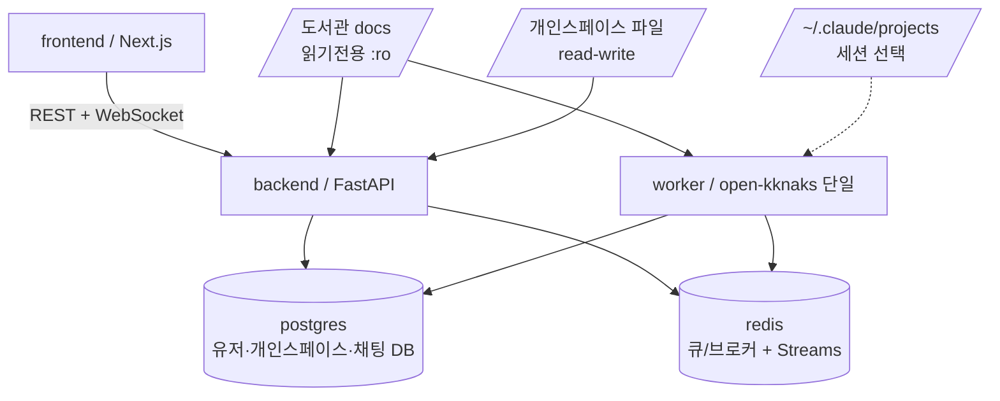

# SC-SPEC-05 환경구성

feature 스펙(SC-SPEC-01~04)이 빌드될 토대 — 스택·레포 레이아웃·docker-compose 토폴로지·테스트 방법을 정의해 누구나 같은 방식으로 띄우고 검증할 수 있음을 보장한다.

> 기능/정책 묶음 단위의 **외부 계약**. client / QA / 외부 통합이 이 문서만 읽고 쓸 수 있어야 합니다.
> table schema 전문, ORM field, repository/service 구조는 본문에 두지 않습니다. 구현 중 DDD/schema 초안은 관련 WP, 실제 schema 는 코드/migration 이 SoT 입니다.

> ★ **환경구성 스펙(Foundation)**: 외부 사용자 계약이 아니라 토대/컨벤션이다. 사용자-facing 섹션(§2 전체, §3 API 계약/Request-Response/케이스 매트릭스)은 "해당 없음"으로 처리하고 토대 내용(스택·레이아웃·토폴로지·테스트)에 집중한다. 버전 핀 구체값·docker 이미지 tag·lock 파일은 **코드가 SoT** — 본문은 스택과 메이저 수준만 둔다.

---

## 1. 개요 (Why)

### 메타

- Domain note: 외부에 드러나는 resource/status/enum 없음 — 환경구성은 사용자-facing 표면이 아니라 빌드/실행 토대다. 본 spec 의 산출은 후속 스캐폴딩 WP/코드가 소비한다(실제 `docker-compose.yml`·lock·이미지 tag 는 코드 SoT). 관련 WP = 스캐폴딩(미착수).
- Open Questions: SC-OPEN-14 (FE 테스트 프레임워크) · SC-OPEN-15 (버전 핀·이미지 tag) — §6 참조

### Business Requirement

- sc_demo 는 mediness 판매용 데모 앱이고, 레포가 아직 비어 있다. feature 스펙(SC-SPEC-01 도서관 / 02 개인스페이스 / 03 유저 / 04 채팅)이 실제로 빌드되려면 그 위에 깔릴 **공통 토대**가 먼저 정의되어야 한다.
- 토대가 흩어지면 각 feature 가 제각각 스택·실행 방식을 가정하게 된다. 본 spec 은 **스택·레포 레이아웃·docker-compose 토폴로지·테스트 방법**을 한 곳에 못박아, 어느 워커가 어느 feature 를 빌드하든 같은 토대 위에서 동작하도록 보장한다.
- 이 spec 은 토대일 뿐 코드가 아니다. 실제 파일(`docker-compose.yml`, lock, Dockerfile)의 생성은 후속 스캐폴딩 WP/코드워커 범위 — 본 spec 은 **결정된 토대만** 문서로 고정한다.

---

## 2. 사용자 경험 (What)

**해당 없음 — 환경구성 스펙(사용자-facing 표면 없음).** 토대/컨벤션 정의이므로 Placement / Wireframe / UX Contract / User Scenario 는 적용되지 않는다. 화면·UX 는 각 feature spec(SC-SPEC-01~04)이 소유한다.

---

## 3. 계약 (How — 토대 구성)

> **외부 API 계약 해당 없음** — 환경구성 스펙은 외부에 노출되는 API 표면이 없다. 아래 API 계약 / Request-Response / 케이스 매트릭스 하위 항목은 "해당 없음"으로 처리하고, 그 자리에 토대 구성(스택·레이아웃·토폴로지)을 둔다. 외부 API 는 각 feature spec 이 소유한다.

### 스택 / 버전

> 스택과 메이저 수준만 고정한다. 버전 핀 구체값·lock·이미지 tag 는 코드 SoT(§6 SC-OPEN-15).

| 영역 | 스택 |
|---|---|
| Backend | Python 3.12 · FastAPI · Pydantic v2 · SQLAlchemy 2.0 (async) + asyncpg · Alembic |
| Worker | Python — 백그라운드 비동기 작업(redis 큐/브로커) |
| Frontend | Next.js (App Router) · TypeScript · React 18+ |
| DB | PostgreSQL · Redis |

### 레포 레이아웃

```
backend/            FastAPI (api 워커가 다루는 영역 경계)
frontend/           Next.js
doc/                SSOT 문서 (이미 존재)
docker-compose.yml  서비스 오케스트레이션 (스캐폴딩 시 생성 — 코드 SoT)
```

### docker-compose 서비스 토폴로지

> 결정된 서비스 구성. 구체 이미지/tag/env 는 코드 SoT.

| 서비스 | 역할 |
|---|---|
| `backend` | FastAPI 애플리케이션 (python) |
| `worker` | **단일 워커** — open-kknaks(Claude Code PTY)를 실행해 채팅 응답을 생성한다(SC-SPEC-04). open-kknaks 내장 RedisBroker/ClaudeWorker 사용. **resume 이식성 때문에 워커는 1개**(멀티턴 세션이 같은 워커에 묶임). host 포트 노출 없음. 도서관 docs read-only 마운트 + 서버 `claude` CLI 인증 필요(아래 §볼륨/마운트) |
| `frontend` | Next.js 애플리케이션 |
| `postgres` | 개인스페이스(SC-SPEC-02)·유저(SC-SPEC-03)·채팅(SC-SPEC-04) DB |
| `redis` | 채팅(SC-SPEC-04) **확정 필수** — open-kknaks 의 큐/브로커 + Redis Streams(응답 스트리밍). `worker` 가 사용 |

### 포트 할당

> sc_demo 는 공용 home-server 에 mediness 등 다른 앱과 함께 배포된다. 포트 충돌을 막기 위해 **`33xxx` 블록**을 sc_demo 전용으로 고정한다(mediness=`2xxxx`, kknaks=`4xxxx` 와 분리). **dev(로컬)·deploy(home-server) 모두 동일한 `33xxx` host 포트**를 쓴다 — 환경별 분기 없음.

| 서비스 | container | host 포트 (dev=deploy) |
|---|---|---|
| `backend` | 8000 | **33080** |
| `frontend` | 3000 | **33000** |
| `postgres` | 5432 | **33432** |
| `redis` | 6379 | **33379** |
| `worker` | — | 없음 (host 포트 노출 X) |

- `33xxx` 블록은 home-server 에서 충돌 없음 확인됨(`33000`/`33080`/`33379`/`33432` 전부 free).

### 볼륨 / 마운트

| 마운트 | 대상 컨테이너 | 모드 | 근거 |
|---|---|---|---|
| 도서관 docs (`medi-doc/`) | **`backend` + `worker`** | bind-mount **읽기 전용(`:ro`)** | `backend` 는 도서관 API(SC-SPEC-01)로 서빙, **`worker` 는 open-kknaks(Claude Code)가 직접 탐색**(cwd=docs 루트). 둘 다 같은 `medi-doc/` 를 `:ro` 로 본다 |
| 개인스페이스 파일 저장 | `backend` | **read-write** | SC-SPEC-02 — 유저가 반입/저작한 파일을 영속. (도크 현재 문서 내용은 `backend` 가 읽어 Redis 작업 페이로드로 `worker` 에 전달 — worker 는 개인스페이스 파일 마운트 불필요) |
| open-kknaks 세션 (`~/.claude/projects`) | `worker` | **read-write (선택)** | 멀티턴 resume 세션 transcript. 단일 워커라 컨테이너 살아있는 동안은 로컬로 충분, **워커 재시작 후 대화 보존이 필요하면 볼륨 마운트**(SC-SPEC-04 SC-OPEN-10) |

#### 도서관 docs bind-mount host 경로

> 도서관 문서 루트(SC-SPEC-01) = 레포 안 `medi-doc/`. dev/deploy 모두 이 디렉토리를 `backend` 컨테이너에 **읽기 전용(`:ro`)** 으로 bind-mount 한다. 컨테이너 내부 마운트 지점은 코드 SoT.

| 환경 | 레포 clone 위치 | docs 루트 host 경로 (bind-mount 원본, `:ro`) |
|---|---|---|
| dev (로컬) | `/Users/kknaks/git/harness_works/sc_demo` | `/Users/kknaks/git/harness_works/sc_demo/medi-doc` |
| deploy (home-server) | `/home/kknaks/sc_demo` | `/home/kknaks/sc_demo/medi-doc` |

- 두 환경 모두 **레포 루트 기준 상대경로 `medi-doc/`** 로 동일 — compose 에서 상대경로(`./medi-doc:<container_path>:ro`)로 쓰면 환경 분기 없이 동작한다(clone 위치만 다르고 레포 내부 구조는 동일).

- **노트(host 의존성)**: 서버 `claude` CLI 인증은 **`worker` 컨테이너**에서 필요하다(open-kknaks 가 worker 에서 Claude Code 를 구동). host 의 claude 인증을 worker 로 전달하는 방식(인증 디렉토리 마운트/env 등)은 코드/WP SoT — 본 spec 은 "worker 에 claude CLI 인증이 가야 한다"는 의존성만 고정한다. (엔진 연동 구조 자체는 SC-SPEC-04 SC-OPEN-10 에서 해소됨.)

#### 토폴로지 다이어그램

> 결정된 서비스(`backend`·`worker`·`frontend`·`postgres`·`redis`)와 마운트 표기.



### Request / Response 상세

**해당 없음 — 외부 API 없음(환경구성 스펙).**

### Validation

**해당 없음 — 외부 입력 표면 없음(환경구성 스펙).**

### 케이스 매트릭스

**해당 없음 — 외부 API/에러 케이스 없음(환경구성 스펙).** 토대 검증 기준은 §5 Acceptance Criteria 로 둔다.

### 상태 / Lifecycle

**해당 없음 — 외부 노출 상태 enum 없음.**

---

## 4. 구현 규칙 (How — 내부)

### 테스트 방법

- **Backend**: pytest + pytest-asyncio (`asyncio_mode=auto`). 테스트 실행은 컨테이너 내부 또는 로컬 양쪽에서 가능하도록 한다(실행 명령·테스트 디렉토리 컨벤션 수준만 고정, 구체 명령 라인은 스캐폴딩 시 확정).
- **Frontend**: 테스트 프레임워크 **미결** — Jest / Vitest / Playwright 등 구체 선택은 코드/WP 범위(§6 SC-OPEN-14). 본 spec 은 "FE 테스트를 둔다"는 의도만 고정하고 프레임워크를 박지 않는다.
- 테스트 실행 명령·디렉토리 컨벤션 altitude 까지만 본문에 둔다. CI 와이어링·커버리지 게이트 등은 본 spec 범위 밖.

### DB

- `postgres` — 유저(SC-SPEC-03 `users`)·개인스페이스(SC-SPEC-02 `personal_docs`)·채팅(SC-SPEC-04 `chat_threads`/`chat_messages`)이 사용. 스키마는 각 feature 의 코드/migration 이 SoT.
- `redis` — 채팅(SC-SPEC-04) 확정 필수: open-kknaks 의 큐/브로커 + Redis Streams(응답 스트리밍). 구체 큐 키/스트림 스키마는 open-kknaks/코드 SoT.
- `worker` — **단일 워커**로 open-kknaks(Claude Code PTY)를 실행해 채팅 응답 생성(SC-SPEC-04). 도서관 docs 를 직접 탐색(cwd=docs `:ro`) + claude CLI 인증 필요. host 포트 노출 없음. (resume 이식성 → 워커 1개.)

### 마이그레이션

- **도구 = Alembic** (SQLAlchemy 2.0 async + asyncpg). 스키마 변경은 전부 Alembic revision 으로 버전 관리하며, 레포에 커밋된다.
- **적용 위치 = entrypoint (런타임)**: `backend` 컨테이너의 **entrypoint 스크립트**에서 앱이 요청을 받기 **전에** `alembic upgrade head` 로 최신까지 적용한 뒤 앱을 기동한다.
  - ❌ **Dockerfile `RUN alembic upgrade head` 금지** — `RUN` 은 빌드타임이라 DB(postgres)가 없어 실패/무의미하다. 마이그레이션은 컨테이너 **start 타임**에 돌아야 한다.
  - ✅ Dockerfile `ENTRYPOINT` 가 가리키는 스크립트(또는 compose `command:`)에서 실행 — `alembic upgrade head` → 시드 → `exec uvicorn …` 순서. 구체 스크립트/command 라인은 코드 SoT.
- **마이그레이션 owner = `backend` 단일**: `worker` 컨테이너는 마이그레이션을 돌리지 않는다(backend·worker 동시 `upgrade head` 시 레이스). `worker` 는 `depends_on` 으로 backend 기동 뒤에 올라온다.
- 각 feature 의 테이블(`users`/SPEC-03, `personal_docs`/SPEC-02, `chat_*`/SPEC-04) 스키마는 해당 feature 코드/migration 이 SoT — 본 spec 은 "Alembic 으로 관리·entrypoint 에서 기동 전 적용·backend 단일 owner" 컨벤션을 고정한다.
- dev/deploy 동일 절차(환경 분기 없음).

### 시드 데이터

> **DB 시드가 반드시 필요한 건 유저(`users`) 뿐.** 개인스페이스·채팅은 로그인 후 유저가 직접 생성하므로 빈 상태로 시작이 정상 플로우(시드 없음). 도서관 시드는 DB 가 아니라 파일시스템이다.

| 대상 | 시드 | 소스 |
|---|---|---|
| 유저 (`users`, SPEC-03) | **필수** — 테스트 계정 5개 `test1@test.com`~`test5@test.com` (비번 `test1admin`~`test5admin`, 표시이름 `Test 1`~`Test 5`, org `test`) | DB seed(코드) — 구체값 SoT = SC-SPEC-03 §4 |
| 도서관 docs (SPEC-01) | 시드 문서 트리 | **파일시스템** `medi-doc/` 읽기전용 bind-mount (§3 볼륨/마운트) — DB 시드 아님 |
| 개인스페이스 (`personal_docs`, SPEC-02) | 없음 — 빈 작업실에서 유저가 직접 생성/업로드 | — |
| 채팅 (`chat_*`, SPEC-04) | 없음 — 로그인 후 대화 생성 | — |

- **실행 시점**: 마이그레이션 적용 **후** entrypoint 에서 idempotent 시드 루틴을 실행한다(이미 있으면 재생성 안 함 — 재기동/재실행 안전). 구체 시드 스크립트/command 는 코드 SoT.
- 유저 시드 비밀번호는 **해시로 저장**(평문 금지) — 위 평문값은 데모 로그인용이며 시드 시 해시한다. 계정 구체값의 SoT 는 SC-SPEC-03 §4 시드 표.
- dev/deploy 동일(환경 분기 없음).

---

## 5. 검증 (Verify)

### Acceptance Criteria

- [ ] `docker compose up` 으로 `backend` · `worker` · `frontend` · `postgres` · `redis` 서비스가 기동된다.
- [ ] host 포트가 §3 포트 할당 표를 따른다 — `backend` 33080 · `frontend` 33000 · `postgres` 33432 · `redis` 33379 (dev=deploy 동일), `worker` 는 host 포트 노출 없음.
- [ ] `worker` 가 **단일 인스턴스**로 `redis` 를 큐/브로커로 기동된다(host 포트 없음, resume 이식성).
- [ ] `worker` 에 도서관 docs 가 읽기 전용으로 마운트되고 서버 `claude` CLI 인증이 주입되어 open-kknaks 가 docs 를 직접 탐색한다(SC-SPEC-04).
- [ ] `backend` 기동 시 Alembic 마이그레이션이 `head` 까지 적용된 뒤 앱이 요청을 받는다.
- [ ] 시드 루틴이 `users` 테스트 계정 5개(`test1@test.com`~`test5@test.com`)를 idempotent 하게 적재한다(비번 해시 저장) — 재기동 시 중복 생성 없음.
- [ ] 개인스페이스(`personal_docs`)·채팅(`chat_*`)은 시드 없이 빈 상태로 시작한다(로그인 후 유저가 생성).
- [ ] 레포 레이아웃이 `backend/` · `frontend/` · `doc/` 구조를 따른다.
- [ ] 도서관 docs 가 읽기 전용 bind-mount 로 `backend`(API 서빙) · `worker`(AI 탐색) 양쪽에 노출된다(SC-SPEC-01·04).
- [ ] 개인스페이스 파일 저장 경로가 read-write 로 마운트된다(SC-SPEC-02).
- [ ] Backend 에서 pytest(+pytest-asyncio, `asyncio_mode=auto`)로 테스트가 실행된다.
- [ ] (SC-OPEN-14 확정 후) Frontend 테스트가 선택된 프레임워크로 실행된다.

---

## 6. Open Questions

- **SC-OPEN-14 (FE 테스트 프레임워크)**: Frontend 테스트 프레임워크(Jest / Vitest / Playwright 등) 미결 → 코드/WP 결정. 본 spec 은 "FE 테스트를 둔다"는 의도만 고정하고 구체 프레임워크를 박지 않는다. §4 테스트 방법·§5 마지막 Acceptance 항목이 이에 종속.
- **SC-OPEN-15 (버전 핀·이미지 tag)**: 스택 메이저 버전은 본문에 고정되나, 구체 버전 lock(예: 패키지 lock 파일)·docker 이미지 tag 는 스캐폴딩 시 **코드가 SoT**. 본 spec 은 메이저 수준만 두고 핀 구체값을 박지 않는다.
- (open-kknaks redis 와이어링은 SC-SPEC-04 SC-OPEN-10 으로 이미 존재 — 본 spec 에서 재정의하지 않고 cross-ref 만 둔다.)
