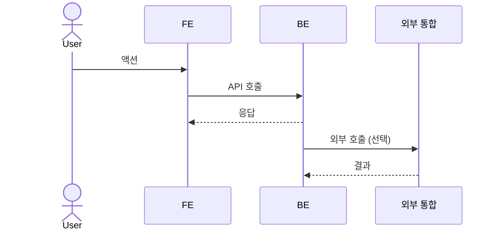
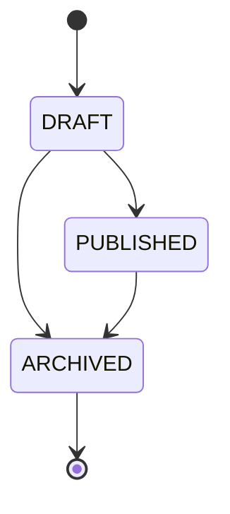

# <PRODUCT>-SPEC-NNN <SPEC 제목>

<1-2줄 요약: 이 기능이 무엇을 보장하는가>

> 기능/정책 묶음 단위의 **외부 계약**. client / QA / 외부 통합이 이 문서만 읽고 쓸 수 있어야 합니다.
> table schema 전문, ORM field, repository/service 구조는 본문에 두지 않습니다. 구현 중 DDD/schema 초안은 관련 WP, 실제 schema 는 코드/migration 이 SoT 입니다.

---

## 1. 개요 (Why)

### 메타

- Domain note: <외부에 드러나는 resource/status/enum 또는 관련 WP>
- Open Questions: <PRODUCT>-OPEN-NNN (또는 없음)

### Business Requirement

<왜 필요한가 — 사용자 / 운영 / 비즈니스 시점에서 이 SPEC 이 보장하는 것>

---

## 2. 사용자 경험 (What)

### Placement

<모달 / 사이드바 등 화면 위치. UI 없는 SPEC (webhook / 백그라운드 처리 등) 은 "해당 없음" 으로 표시>

#### Wireframe

```
+─────────────────────────────────────────────────+
│ <상단 헤더>                                       │
+──────────────┬──────────────────────────────────+
│ <사이드바>   │ <탭 / 브레드크럼>                 │
│ ▾ 메뉴       ├──────────────────────────────────┤
│  하위 항목   │                                  │
│              │ <SPEC 화면 본문>                  │
│              │                                  │
+──────────────┴──────────────────────────────────+
```

### UX Contract

- **화면 상태**: 각 상태별 표시 (예: 정상 / 로딩 / 빈 / 에러)
- **문구**: 화면에 노출되는 모든 텍스트 (헤더, 라벨, 플레이스홀더, 안내, 에러 메시지)
- **CTA**: 사용자 액션 트리거 (버튼 이름 / 사용 컴포넌트 / 위치 / 활성·비활성 조건)
- **UX 기대 결과**: 액션 후 무엇이 일어나는가 (페이지 이동 / 모달 / 토스트 / 데이터 갱신)
- (UI 없으면 "해당 없음")

### User Scenario

케이스별 시나리오. 각 줄 `{조건/동작} → {결과}`. 정상·비정상·경계·권한·빈 상태·조건부 노출 등 **케이스마다 나열** (QA 가 시나리오 1:1 로 TC 추출). UI 없는 SPEC 은 "해당 없음".

- (정상) {동작} → {결과}
- (비정상) {동작} → {결과}
- (경계/빈/조건부) {동작} → {결과}

> 전체 end-to-end 흐름은 §3 Flow 의 sequence diagram 으로 (여기선 케이스 나열에 집중).

---

## 3. 계약 (How — 인터페이스)

### API 계약

| Method | Path | 요약 | 권한 |
|---|---|---|---|
| POST | `/api/v1/<resource>` | ... | admin / staff |

#### Request / Response 상세

<엔드포인트별 정상 응답 schema · status code. **에러는 여기 두지 않고 케이스 매트릭스 단일 SoT**. 긴 JSON schema 는 별도 sample 파일로 분리하고 link>

### Validation

> 입력 검증 규칙 — **어떤 입력이 valid 한가** 만. FE(즉시 피드백·UX) / BE(최종 신뢰 경계·보안) 가 같은 규칙을 각자 구현.
> 위반 시 에러코드·표시·위치는 케이스 매트릭스의 `VALIDATION_ERROR` 행 (필드별 메시지는 field array).

| 필드 | 규칙 |
|---|---|
|  |  |

### 케이스 매트릭스

> **모든 에러/경계 케이스의 단일 SoT** (validation 위반 · 권한 · 충돌 · 빈상태 · 로딩 등). API 상세는 정상 응답만, 에러는 전부 여기.

| 에러 코드 | 백엔드 출력 | 프론트 출력 | 표시 위치 |
|---|---|---|---|
|  |  |  |  |

### Flow

end-to-end 흐름 (sequence diagram).



### 상태 / Lifecycle

외부에 노출되는 enum · 상태 transition.



내부 구현 invariant (FOR UPDATE / partial unique 등) 는 관련 WP 또는 코드/migration 에 둡니다. 여러 WP 가 반복 참조하면 optional architecture 로 승격합니다.

---

## 4. 구현 규칙 (How — 내부)

### Frontend Implementation

> 리액트 구현 시작점. 라우트 → 페이지 → 컴포넌트 → 상태 → 데이터 연동 순.

- **라우트**: <URL 경로 / 동적 세그먼트>
- **페이지 / 레이아웃**: <페이지 컴포넌트 파일 + 레이아웃 위치>
- **컴포넌트**: 화면 구성 컴포넌트 (공통 재사용분 + 신규분 구분)
  - 재사용: <기존 공통 컴포넌트>
  - 신규: <이 SPEC 에서 새로 만들 컴포넌트>
- **상태 (state)**: <로컬 / 전역 / 서버 상태. 어떤 데이터를 어디서 관리>
- **데이터 연동**: <어느 API(위 API 계약) 를 어느 훅/호출로>

### Functional Rule

- 멱등성 · 동시성 · timeout · retry 계약
- 권한 검증 · 예외 처리
- (외부에서 보이는 행동 규칙 — 내부 구현 detail 은 WP 또는 코드에)

### DB

- 어떤 테이블 쓰는지

---

## 5. 검증 (Verify)

### Acceptance Criteria

- [ ] 항목 1
- [ ] 항목 2

---

## 6. Open Questions

- (없음 또는 <PRODUCT>-OPEN-NNN link)
