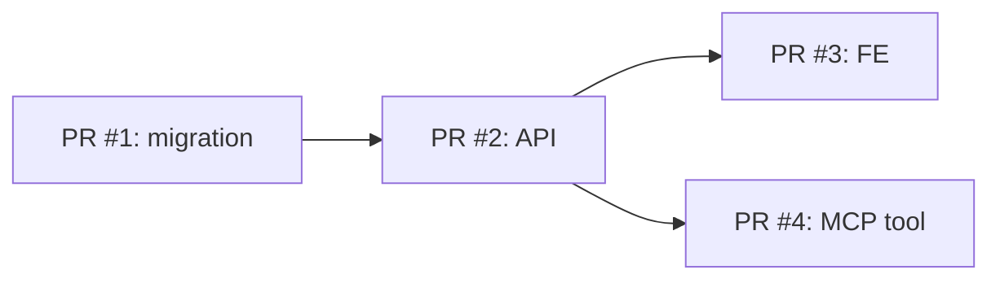

# <PRODUCT>-WP-NNN <WP 제목>

<1-2줄 요약: 이 WP 가 무엇을 만드는가>

> 1 파일 = 1 WP = **빌드 계획**. dev 가 이 문서만 보고 PR 분리 / 일정 / 작업 시작이 가능해야 합니다.
> SPEC (외부 계약) 본문은 복제하지 않고 link 만. 구현 중 DDD/schema 초안은 여기, 실제 schema 는 코드/migration 이 SoT 입니다.
> Status Board / Spec Coverage 는 [work-map.md](../work-map.md).

## 메타

- 의존 WP: <PRODUCT>-WP-NNN (또는 없음)
- 병렬 가능 WP: <PRODUCT>-WP-NNN (또는 없음)

## Code Surface

- Repo / module: <어디>
- 만질 파일 후보:
  - `backend/app/api/v1/...`
  - `backend/app/services/...`
  - `frontend/src/app/...`
  - `mcp/...`
- Domain / schema note:
  - <aggregate/entity 초안, migration 필요 여부, 코드 위치 후보>
  - <실제 schema 전문은 코드/migration 링크>

## PR Plan

- 한 PR 끝낼지 / 여러 PR 로 나눌지 기준:
- 선행 PR:
- PR 순서:
  1. PR #1: <예: alembic migration>
  2. PR #2: <예: API endpoint 구현>
  3. PR #3: <예: FE wiring>

<!-- PR 의존성이 복잡하면 mermaid graph LR 옵션:

-->

## Dev Plan

1. <step 1 — 예: alembic migration 작성·local 검증>
2. <step 2 — 예: SQLAlchemy model + repository>
3. <step 3 — 예: API endpoint 구현 (SPEC API 계약 준수)>
4. <step 4 — 예: FE wiring + e2e 시나리오>

## Progress Checklist

> Dev Plan 의 step / commit 단위 진척. 커밋 push 시 워커가 직접 ✅ 박고 PR / SHA 채운다.
> grep 위반·회귀 카운트 같은 정량 지표가 따로 있으면 §Acceptance Criteria 또는 §Test/QA Plan 에 별도.
> 단일 PR + 다중 커밋 구조면 commit 단위, 다중 PR 구조면 PR 단위로 작성.

- [ ] <Step/Commit 1 — 예: C0 chore: add BaseRepository scaffold> — PR: `-`, SHA: `-`
- [ ] <Step/Commit 2> — PR: `-`, SHA: `-`
- [ ] <Step/Commit 3> — PR: `-`, SHA: `-`

## Test / QA Plan

- 단위: <범위>
- 통합: <범위>
- E2E: <시나리오 N개>
- QA Sheet: <PRODUCT>-QA-NNN (또는 placeholder)
- 회귀 검증: <기존 영향 받는 SPEC 들>

## Release Gate

- [ ] Scope 모든 SPEC 의 Acceptance Criteria 통과
- [ ] 단위 / 통합 / E2E 테스트 통과
- [ ] QA Sheet 시나리오 pass
- [ ] work-map 의 Status Board / Spec Coverage 갱신

## Closure (WP 종결 시 작성)

> Release Gate 모든 항목 통과 시 본 섹션 작성.
> 다른 팀/워커가 work-NN 한 장만 보고 "끝났음 / 무엇이 남았나 / 무엇을 참조해야 하나" 를 알 수 있는 SSOT.

### 종결 메타

- Status `done` 일자: YYYY-MM-DD
- 커밋 범위: <시작 SHA>..<마지막 SHA> (N 커밋)
- 최종 PR / 머지 SHA: <PR# 또는 SHA>
- Owner: <agent/사람>

### 지표 (사전 → 최종)

§사전 스캔 결과의 사전 측정값과 최종 측정값 비교.

| 지표 | 사전 | 최종 | 비고 |
|---|---:|---:|---|
|  |  |  |  |

### 신규 / 제거 자산

다음 WP 가 참조해야 할 인프라/모듈/의존성/컨벤션 정리.

**신규**
- 신규 파일/모듈:
- 신규 의존성:
- 신규 컨벤션:

**제거**
- 제거 코드/함수:
- 제거 의존성:

### 후속 태스크 (액션 가능 항목만)

- **별도 WP 후보**: 제목 / 사유 / 우선순위 / 영향 범위
- **ADR 후보**: 결정 필요 항목 / owner / deadline
- **알려진 부채**: 위치 / 영향 / 처리 시점

> 운영 메모·교훈은 별도 retro 문서.
> 본 §Closure 의 §후속 은 *발주 가능한 항목만*.

## Open Issues

- 개발팀 내부 결정 필요 항목 (module 경계 / 파일 구조 / mock 전략 등)
- (상위 결정이 필요한 항목 — scope/벤더/정책/비용/일정 변경 — 은 admin 경유 OQ 로 승격)
