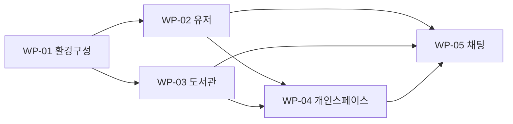

# sc_demo Work

최종 수정: 2026-06-07

sc_demo(온톨로지 데모앱 — Next.js FE + FastAPI BE + Worker(open-kknaks) + Redis/Postgres)의 현재 구현, QA, 릴리즈 상태를 추적하는 map 입니다. 상세 WP 실행 본문은 `work/` 아래 1 파일 = 1 WP 로 둡니다.

외부 계약(SPEC)은 [spec-map.md](spec-map.md) 와 `spec/` 참조.

Status 값: `draft`, `in_dev`, `ready_for_qa`, `qa_blocked`, `ready_for_release`, `done`

> ★ **진행 단위 = commit** (PO 결정 2026-06-07): WP 당 PR 을 매번 쪼개지 않는다. **1 WP = 1 PR(또는 직접 머지), 그 안에서 commit 단위로 진행**한다. 각 work 상세의 §Dev Plan / §Progress Checklist 는 **commit 단위**로 작성(다중 PR 구조 아님).
> ★ **분해 = 기능 단위**: 5개 feature(환경/유저/도서관/개인스페이스/채팅) = 5 WP, SPEC 1:1. Phase 는 의존성 순서.

## Status Board

| Phase | WP | Scope | Status | Owner | 진행단위 | Blocker | 다음 |
|---|---|---|---|---|---|---|---|
| 1 | [SC-WP-01 환경구성/스캐폴딩](work/work-01-environment.md) | SC-SPEC-05 | ready_for_qa | api+web-fe | commit | - | C1~C5 ✅ + worker claude 로컬검증(48b0fb8) → Phase 2 착수 |
| 2 | [SC-WP-02 유저/인증](work/work-02-user.md) | SC-SPEC-03 | draft | BE+FE | commit | WP-01 | WP-01 후 착수 |
| 2 | [SC-WP-03 도서관](work/work-03-library.md) | SC-SPEC-01 | draft | BE+FE | commit | WP-01 | WP-01 후(02 와 병렬) |
| 3 | [SC-WP-04 개인스페이스](work/work-04-personal-space.md) | SC-SPEC-02 | draft | BE+FE | commit | WP-02·03 | 유저·도서관 렌더 후 |
| 4 | [SC-WP-05 채팅](work/work-05-chat.md) | SC-SPEC-04 | draft | BE+FE | commit | WP-02·03·04 | 마지막 |

## WP List

| ID | 제목 | Status | Owner | 파일 | Covers SPEC |
|---|---|---|---|---|---|
| SC-WP-01 | 환경구성/스캐폴딩 | draft | TBD | [work-01-environment.md](work/work-01-environment.md) | SC-SPEC-05 |
| SC-WP-02 | 유저/인증 | draft | BE+FE | [work-02-user.md](work/work-02-user.md) | SC-SPEC-03 |
| SC-WP-03 | 도서관 | draft | BE+FE | [work-03-library.md](work/work-03-library.md) | SC-SPEC-01 |
| SC-WP-04 | 개인스페이스 | draft | BE+FE | [work-04-personal-space.md](work/work-04-personal-space.md) | SC-SPEC-02 |
| SC-WP-05 | 채팅 | draft | BE+FE | [work-05-chat.md](work/work-05-chat.md) | SC-SPEC-04 |

## 의존성 / 병렬

- **WP-01** 은 모든 것의 선행(토대).
- **WP-02·03** 은 WP-01 후 **병렬 가능**(유저·도서관 독립).
- **WP-04** 는 WP-02(유저 스코프) + WP-03(4포맷 렌더 재사용) 의존.
- **WP-05** 는 WP-02(유저)·WP-03(그라운딩)·WP-04(md write 타겟) 전부 의존 — 마지막.

## Spec Coverage

각 SPEC 이 어느 WP 에서 구현되며 현재 진척이 어떤지 보는 SPEC-centric view.

| Spec ID | 제목 | Covering WP | 구현 상태 |
|---|---|---|---|
| SC-SPEC-05 | 환경구성 | SC-WP-01 | ready_for_qa (C1~C5 ✅, deploy 검증 남음) |
| SC-SPEC-03 | 유저 | SC-WP-02 | draft |
| SC-SPEC-01 | 도서관 | SC-WP-03 | draft |
| SC-SPEC-02 | 개인스페이스 | SC-WP-04 | draft |
| SC-SPEC-04 | 채팅 | SC-WP-05 | draft |

## Release Gate - sc_demo v1

### Scope

- [ ] 릴리즈 대상 = SC-SPEC-01~05 전부.
- [ ] 포함/제외 범위가 spec-map 의 Scope 와 맞다.

### Code

- [ ] 5개 WP 의 PR 이 머지됐다.

### Spec

- [ ] spec-map / `spec/` 변경이 리뷰·머지됐다.
- [ ] blocker open question 0 (현재 전 SPEC OQ 해소).

### QA

- [ ] 각 SPEC Acceptance Criteria 통과.
- [ ] blocking fail 없음.
